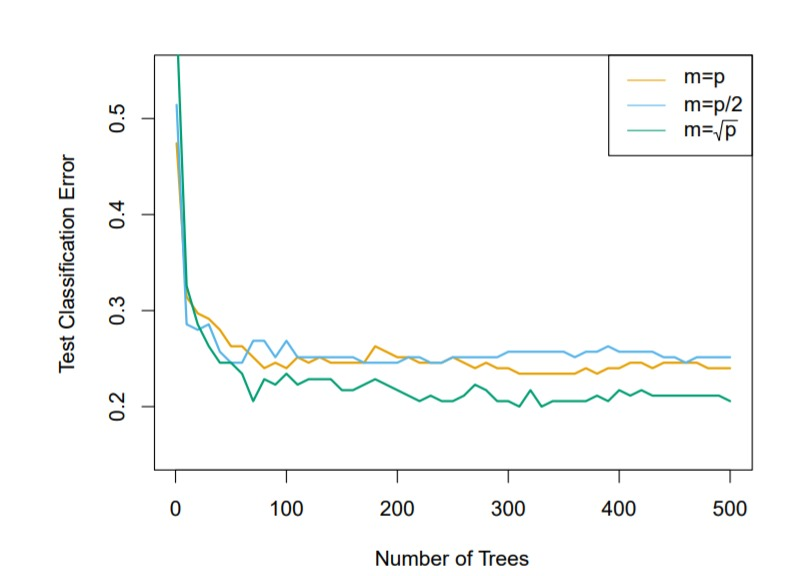
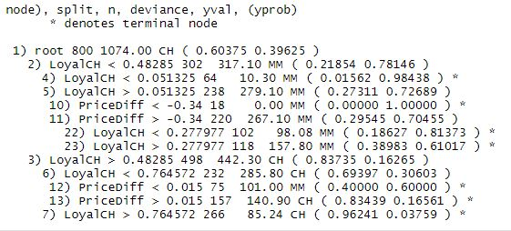

```{r setup, include=FALSE}
knitr::opts_chunk$set(
	echo = TRUE,
	message = FALSE,
	warning = FALSE,
	fig.align = "center", 
	out.width = '70%'
)
```

El presente trabajo muestra el desarrollo de algunos de los ejercicios prácticos propuestos en el libro "An Introduction to Statistical Learning with Applications in R".

```{r}
library(ggplot2)
library(pROC)
library(e1071)
library(ISLR)
library(ggplot2)
library(MLmetrics)
library(tree)
library(MASS)
library(class)
library(randomForest)
library(tidyverse)
library(glmnet)
library(gbm)
```

# Apartado 4.7

# Punto 10

## Introducción

En el siguiente estudio, se presentan resultados analíticos del set de datos Weekly del paquete ISLR, este set de datos contiene los datos del porcentaje de retorno del índice S&P 500 a lo largo de las semanas en 20 años, desde 1990 hasta 2010. 

El set de datos contiene las variables año, el retorno porcentual de la semana, 5 variables del retorno porcentual de cada una de las semanas anteriores, una variable volumen (número promedio de acciones comerciadas diariamente, en billones), y finalmente la dirección, que indica si el retorno fue positivo o negativo dicha semana.

```{r}
head(Weekly)
```

## Literal a), Resumen de los datos 

El resumen de los datos muestra un promedio de crecimiento porcentual positivo del día de $0.14\%$, lo que indica que a lo largo del tiempo el porcentaje de retorno del S&P es bastante variable y tiende a mantener un equilibrio entre incremento y disminución del mismo.

La variable 'Direction' muestra $605$ subidas contra $484$ caídas, lo que indica que a la larga el S&P incrementa su valor en el tiempo.

```{r}
summary(Weekly)
```

En el siguiente Diagrama de Caja se pueden identificar la varianza de los datos en cada año

Los años con una varianza menor se podrían relacionar con años con poca incertidumbre económica, mientras que los años con una varianza mayor podrían relacionarse con años en los que el S&P se comportó de una manera más volátil, un ejemplo de esto es el año 2008, donde ocurrió una crisis financiera y una [crisis bursátil mundial](https://es.wikipedia.org/wiki/Crisis_bursátil_mundial_de_octubre_de_2008)

```{r}
Weekly$YFactor <- as.factor(Weekly$Year) # Año como factor para producir un Box Plot
ggplot(data= Weekly, mapping = aes(x = YFactor, y= Today)) + 
  geom_boxplot() + 
  xlab("Año") + 
  ylab("Porcentaje de Retorno")
```

### Gráfica histórica de los puntos

La gráfica histórica de los puntos muestra el constante incremento y disminución del porcentaje de retorno, sobresalen los puntos alrededor del año 2008 debido a la crisis financiera ya mencionada.

```{r}
ggplot(data= Weekly, mapping = aes(x = c(1:length(Year)), y= Today)) + 
  geom_line() + 
  geom_point() + 
  xlab("Registro") + 
  ylab("Porcentaje de Retorno") + 
  labs(title="Serie histórica de Porcentaje de Retorno")
```

Se realiza una gráfica con menos puntos para poder visualizar de una mejor manera.

```{r}
ggplot(data= Weekly[1:300,], mapping = aes(x = c(1:length(Year)), y= Today)) +
  geom_line() + 
  geom_point() + 
  xlab("Registro") + 
  ylab("Porcentaje de Retorno") + 
  labs(title="Serie histórica de Porcentaje de Retorno")
```

## Literal b), Regresión logística

Se realiza una regresión logística con todos los datos, tienendo como variable respuesta la dirección, las 5 variables de delay (Lag) más el volumen (Volume) como predictores.

```{r}
weekly_glm <- glm(Direction ~ Lag1+Lag2+Lag3+Lag4+Lag5+Volume, 
                  data= Weekly, family="binomial")
summary(weekly_glm)
```

El único predictor que parece ser un estadísticamente significante es la variable Lag2, pero no demuestra mayor significancia.

## Literal c), Matriz de confusión

```{r}
contrasts(as.factor(Weekly$Direction)) # Nos indica que Down es un 0 y Up es un 1, para interpretar los resultados de la predicción
```

La matriz de confusión demuestra que el error más grande son los falsos positivos, en este caso el positivo se da cuando se predice un incremento en el porcentaje de retorno, y el falso es que realmente era un decrecimiento, la matriz de confusión también muestra que el modelo en la mayor parte de los datos predice un incremento, y tan solo alrededor de 100 veces predice una disminución.

```{r}
predicted <- round(predict(weekly_glm, newdata=Weekly, type="response")) # Predicción
real <- weekly_glm$y # Reales

c_matrix <- ConfusionMatrix(predicted, real) # Matriz de confusión
print(sprintf("El porcentaje de aciertos es de %f%s", Accuracy(predicted,real)*100, "%"))

c_matrix
```

## Literal d), Regresión logística 2

Se realiza otra regresión logística, teniendo en cuenta esta vez solamente la variable Lag2, y usando los datos de entrenamiento desde el 1990 hasta el 2008.
```{r}
weekly_tr <- subset(Weekly, Year <= 2008) # Datos de entrenamiento
weekly_vl <- subset(Weekly, Year > 2008) # Datos de validación
```

```{r}
weekly_glm2 <- glm(Direction ~ Lag2, data= weekly_tr, family="binomial")
summary(weekly_glm2)
```

La matriz de confusión muestra unos resultados similares a los anteriores, en los que el mayor error se presenta en los falsos positivos.

```{r}
predicted <- round(predict(weekly_glm2, newdata=weekly_vl,  type="response")) # Predicción
real <- ifelse(weekly_vl$Direction=="Up",1,0) # Reales

c_matrix2 <- ConfusionMatrix(predicted, real) # Matriz de confusión
print(sprintf("El porcentaje de aciertos es de %f%s", Accuracy(predicted,real)*100, "%"))
c_matrix2
```

## Literal e), LDA

```{r}
weekly_lda <- lda(Direction ~ Lag2, data = weekly_tr)
weekly_lda
```

Las predicciones realizadas por el LDA son identicas a las realizadas por el GLM.

```{r}
predicted <- predict(weekly_lda, newdata=weekly_vl) # Predicción
real <- weekly_vl$Direction # Reales

c_matrix_lda <- ConfusionMatrix(predicted$class, real) # Matriz de confusión
print(sprintf("El porcentaje de aciertos es de %f%s", Accuracy(predicted$class,real)*100, "%"))
c_matrix_lda
```

## Literal f), QDA

```{r}
weekly_qda <- qda(Direction ~ Lag2, data = weekly_tr)
weekly_qda
```

El QDA muestra los peores resultados en terminos de generalidad ya que no marca ninguna disminución.

```{r}
predicted <- predict(weekly_qda, newdata=weekly_vl) # Predicción
real <- weekly_vl$Direction # Reales

c_matrix_lda <- ConfusionMatrix(predicted$class, real) # Matriz de confusión
print(sprintf("El porcentaje de aciertos es de %f%s", Accuracy(predicted$class,real)*100, "%"))
c_matrix_lda
```

## Literal g), KNN con k=1

```{r}
# Preparación de los datos
x_tr <- cbind(weekly_tr$Lag2)
x_vl <- cbind(weekly_vl$Lag2)

y_tr <- weekly_tr$Direction
y_vl <- weekly_vl$Direction
```

La aproximación por KNN muestra unos resultados más alejados a los otros modelos, y predice correctamente el $50\%$ de los datos, con más variabilidad entre respuestas de incremento y disminución.

```{r}
set.seed(2020)
predicted = knn(train = x_tr, test = x_vl, cl = y_tr, k = 1)
print(sprintf("El porcentaje de aciertos es de %f%s", Accuracy(predicted,y_vl)*100, "%"))
table(predicted, y_vl)
```

## Literal h), Resultados

Los modelos lineales (GLM y LDA) son los que demuestran el mejor porcentaje de aciertos, ambos con $65$ aciertos, aunque con un claro desbalance a predecir incrementos en el porcentaje de retorno. El QDA es el modelo más desbalanceados ya que no predice ni una sola disminución. Por último el modelo de agrupación con KNN muestra los resultados con mejor generalidad ya que tiene una buena cantidad de aciertos $52$ y estos se reparten en predicciones de incremento y disminución.

## Literal i), Experimentación

### Agregando la variable volumen como predictor

Agregar la variable volumen, aunque no aumente el porcentaje de aciertos, si le agrega cierto nivel de variación a las predicciones, ya que se predicen más disminuciones que en las aproximaciones anteriores. Se obtiene el mejor resultado al realizar KNN con $k=1$ con un $55\%$ de aciertos, aún así siendo un resultado bastante bajo para un problema de clasificación binaria.

#### GLM

```{r}
weekly_glm <- glm(Direction ~ Lag2 + Volume, data = weekly_tr, 
                  family = "binomial")

predicted <- round(predict(weekly_glm, newdata = weekly_vl, type="response"))
real <- ifelse(weekly_vl$Direction=="Up",1,0)

print(sprintf("El porcentaje de aciertos es de %f%s", Accuracy(predicted,real)*100, "%"))
ConfusionMatrix(predicted, real)
```
#### LDA

```{r}
weekly_lda <- lda(Direction ~ Lag2 + Volume, data= weekly_tr)
predicted <- predict(weekly_lda, newdata=weekly_vl) # Predicción
real <- weekly_vl$Direction # Reales

c_matrix_lda <- ConfusionMatrix(predicted$class, real) # Matriz de confusión
print(sprintf("El porcentaje de aciertos es de %f%s", Accuracy(predicted$class,real)*100, "%"))
c_matrix_lda
```
#### QDA

```{r}
weekly_qda <- qda(Direction ~ Lag2 + Volume, data= weekly_tr)
predicted <- predict(weekly_qda, newdata=weekly_vl) # Predicción
real <- weekly_vl$Direction # Reales

c_matrix_lda <- ConfusionMatrix(predicted$class, real) # Matriz de confusión
print(sprintf("El porcentaje de aciertos es de %f%s", Accuracy(predicted$class,real)*100, "%"))
c_matrix_lda
```
#### KNN

```{r}
# Preparación de los datos
x_tr <- cbind(weekly_tr$Lag2,weekly_tr$Volume)
x_vl <- cbind(weekly_vl$Lag2,weekly_vl$Volume)

y_tr <- weekly_tr$Direction
y_vl <- weekly_vl$Direction
for (k in c(1:10)){
  set.seed(2020)
  predicted = knn(train = x_tr, test = x_vl, cl = y_tr, k = k)
  print(sprintf("El porcentaje de aciertos para k=%i es de %f%s",k,Accuracy(predicted,y_vl)*100, "%"))
}
```

KNN con $k=1$ ha sido el método que ha demostrado el mejor comportamiento, y por ende se seguirá experimentando con el mismo.

#### KNN con k=1, usando todas las variables

El porcentaje de aciertos disminuye al usar todas las variables con KNN $k=1$.

```{r}
x_tr <- cbind(weekly_tr$Lag1,weekly_tr$Lag2, weekly_tr$Lag3, weekly_tr$Lag4,weekly_tr$Lag5,weekly_tr$Volume)
x_vl <- cbind(weekly_vl$Lag1,weekly_vl$Lag2, weekly_vl$Lag3, weekly_vl$Lag4,weekly_vl$Lag5,weekly_vl$Volume)

y_tr <- weekly_tr$Direction
y_vl <- weekly_vl$Direction

set.seed(2020)
predicted = knn(train = x_tr, test = x_vl, cl = y_tr, k = 1)
print(sprintf("El porcentaje de aciertos es de %f%s",Accuracy(predicted,y_vl)*100, "%"))
ConfusionMatrix(predicted, y_vl)
```
#### KNN con k=1, variando los predictores de delay

Se realiza una comparación del comportamiento del modelo variando los predictores.

```{r}
y_tr <- weekly_tr$Direction
y_vl <- weekly_vl$Direction
predictors <- c("Lag1", "Lag2", "Lag3", "Lag4", "Lag5")
for (i in predictors){
  x_tr <- cbind(weekly_tr[[as.name(i)]], weekly_tr$Volume)
  x_vl <- cbind(weekly_vl[[as.name(i)]], weekly_vl$Volume)
  set.seed(2020)
  predicted = knn(train = x_tr, test = x_vl, cl = y_tr, k = 1)
  print(sprintf("El porcentaje de aciertos con el predictor %s es de %f%s",i,Accuracy(predicted,y_vl)*100, "%"))
}

```

#### Conclusión

Realizando diversos modelos variando los predictores de delay, se ha encontrado que el modelo más efectivo es el KNN con $k=1$, utilizando Lag2 y Volume como predictores. Aún así ninguno de los modelos refleja buenos resultados, como máximo se alcanza un $55\%$, porcentaje bastante bajo para un problema de clasificación binario. Es posible que se necesiten más datos, o sea necesario realizar limpieza en los datos para expulsar los datos anomalos.

# Punto 11

## Introducción

En este problema el objetivo es obtener un modelo para predecir si un automóvil obtiene un buen
rendimiento de gasolina, basándose en el set de datos Auto.

El dataset cuenta con varios datos acerca de las especificaciones del automóvil, y las millas por galón como el dato que da a entender el rendimiento del carro.

```{r}
summary(Auto)
```

## Literal a), Creación de la variable binaria mpg01

Se procede a crear una variable binaria mpg01 la cuál es verdadera si el mpg es superior a la mediana del mpg a lo largo del dataset, la mediana en este caso es de $22.75$.

```{r}
Auto$mpg01 <- (Auto$mpg >= median(Auto$mpg))
median(Auto$mpg)
```

Efectivamente el ejercicio anterior resulta en una división igualitaria de los autos.

```{r}
summary(Auto$mpg01)
```

FALSE indica un $0$ y TRUE indica un $1$.

```{r}
contrasts(as.factor(Auto$mpg01))
```

## Literal b), Análisis exploratorio

Se realizará un análisis de cada variable contra la variable mpg para decidir cuáles serán los predictores usados en los modelos.

### Número de Cilindros

Se realiza una gráfica de puntos agregando la línea roja de la mediana, donde los valores encima o sobre esta tienen un valor de $mpg01 = 1$ y las que estén por debajo un valor de $mpg01 = 0$.

La gráfica muestra que para cada número de cilindros es posible tener un buen rendimiento de mpg, destaca que los autos con 4 cilindros tienen más ocurrencias en valores altos de mpg, y los de 8 cilindros en valores bajos, se alcanza a notar una pequeña tendencia a entre más cilindros, peor rendimiento de mpg, pero no es del todo clara.


```{r}

# Cilindros
ggplot(data = Auto, mapping=aes(x = cylinders, y=mpg)) + geom_point() + geom_line(mapping= aes(x = cylinders,y = median(mpg), col="Mediana")) + labs(title="Comportamiento del No. de Cilindros",x = "Número de Cilindros", y = "Millas por galón", color="Leyenda") + scale_color_manual(values = c("Mediana" = "red")) 
```


### Desplazamiento

En esta gráfica se nota una clara tendencia en la que los vehículos con un desplazamiento más bajo muestran el mejor rendimiento de mpg.

```{r}
# Displacement
displacement_g <- ggplot(data = Auto, mapping=aes(x = displacement, y=mpg))
displacement_g + geom_point() + geom_line(mapping= aes(x = displacement,y = median(mpg), col="Mediana")) + labs(title="Comportamiento del Desplazamiento" ,x = "Desplazamiento en Pulgadas Cúbicas", y = "Millas por galón", color="Leyenda") + scale_color_manual(values = c("Mediana" = "red")) 
```

### Caballos de fuerza

Al igual que con el desplazamiento, al tener menos caballos de fuerza mejor es el rendimiento en mpg.

```{r}
horsepower_g <- ggplot(data = Auto, mapping=aes(x = horsepower, y=mpg))
horsepower_g + geom_point() + geom_line(mapping= aes(x = horsepower,y = median(mpg), col="Mediana")) + labs(title="Comportamiento de los Caballos de Fuerza",x = "Caballos de fuerza", y = "Millas por galón", color="Leyenda") + scale_color_manual(values = c("Mediana" = "red"))
```

### Masa

Al igual que el desplazamiento y los caballos de fuerza, los carros más livianos presentan un mejor rendimiento en mpg. Este comportamiento de las 3 variables podría sugerir una correlación de las mismas.

```{r}
weight_g <- ggplot(data = Auto, mapping=aes(x = weight, y=mpg))
weight_g + geom_point() + geom_line(mapping= aes(x = weight,y = median(mpg), col="Mediana")) + labs(title="Comportamiento de la Masa",x = "Masa del carro en libras", y = "Millas por galón", color="Leyenda") + scale_color_manual(values = c("Mediana" = "red"))
```

### Tiempo de aceleración de 0 a 60 mph

La gráfica no sugiere una relación directa entre el tiempo de aceleración, al menos para los valores
entre 11 y 23 segundos, aproximadamente, sin embargo se identifica que los autos que presentan una aceleración de 10 o menos segundos generalmente presentan un mal rendimiento en mpg.

```{r}
accel_g <- ggplot(data = Auto, mapping=aes(x = acceleration, y=mpg))
accel_g + geom_point() + geom_line(mapping= aes(x = acceleration,y = median(mpg), col="Mediana")) + labs(titile="Comportamiento de la aceleración",x = "Tiempo en segundos para acelerar a 60 mph", y = "Millas por galón", color="Leyenda") + scale_color_manual(values = c("Mediana" = "red"))
```

### País de origen

La diferenciación por país de origen demuestra una clara diferencia en el rendimiento en mpg, donde los autos americanos presentan el peor, y los europeos y japoneses el mejor.

```{r}
# Factor de origen
Auto$forigin <- as.factor(Auto$origin)

origin_g <- ggplot(data = Auto, mapping=aes(x = forigin, y=mpg))
origin_g + geom_boxplot() + geom_line(mapping= aes(x = forigin,y = median(mpg), col="Mediana")) + labs(title="Comportamiento del Origen del Automóvil",x = "Origen del Automóvil", y = "Millas por galón", color="Leyenda") + scale_x_discrete(labels = c("1" = "Americano", "2" = "Europeo", "3" = "Japonés"))
```

### Año del modelo

Se muestra que a medida que aumenta el año se reduce el mpg, sin embargo no hay una diferenciación absoluta, todos los años tienen al menos un carro con buen rendimiento en mpg y con mal rendimiento en mpg.

```{r}
year_g <- ggplot(data = Auto, mapping=aes(x = year, y=mpg))
year_g + geom_point() + geom_line(mapping= aes(x = year,y = median(mpg), col="Mediana")) + labs(title="Comportamiento por Año" ,x = "Año", y = "Millas por galón", color="Leyenda") + scale_color_manual(values = c("Mediana" = "red")) + scale_x_continuous(breaks = c(70:82))
```

### Nombre del carro

La variable de nombre del carro posee muchos niveles y una diferenciación por el mismo no sería del todo buena, ya que no se cuentan con muchos datos.

```{r}
length(levels(Auto$name))
```

### Elección de predictores

Los predictores elegidos según el análisis serán:
- Desplazamiento (displacement)
- Caballos de fuerza (horsepower)
- Masa del vehículo (weight)
- Origen del auto (forigin)

```{r}
formula <- mpg01 ~ displacement + horsepower + weight + forigin
```

## Literal c), División del set de datos

Para la división del set de datos se toma una muestra aleatoria del $80\%$ para entrenamiento y el $20\%$ restante para validación.

```{r}
# Se encuentra el tamaño del set de datos (tomando el 80% para entrenamiento)
sample_size = floor(0.8*nrow(Auto))
set.seed(2020)

# Dividir el set de datos aleatoriamente
picked = sample(seq_len(nrow(Auto)),size = sample_size)
auto_tr =Auto[picked,]
auto_vl =Auto[-picked,]
```

## Literal d), LDA

```{r}
auto_lda <- lda(formula, data = auto_tr)
auto_lda
```

```{r}
predicted <- predict(auto_lda, newdata=auto_vl) # Predicción
real <- auto_vl$mpg01 # Reales

c_matrix_lda <- ConfusionMatrix(predicted$class, real) # Matriz de confusión
print(sprintf("El porcentaje de aciertos para es de %f%s", Accuracy(predicted$class,real)*100, "%"))
c_matrix_lda


```
## Literal e), QDA

```{r}
auto_qda <- qda(formula, data = auto_tr)
auto_qda
```

```{r}
predicted <- predict(auto_qda, newdata=auto_vl) # Predicción
real <- auto_vl$mpg01 # Reales

c_matrix_qda <- ConfusionMatrix(predicted$class, real) # Matriz de confusión
print(sprintf("El porcentaje de aciertos para es de %f%s", Accuracy(predicted$class,real)*100, "%"))
c_matrix_qda
```

## Literal f), Regresión logística

```{r}
auto_glm <- glm(formula, data= auto_tr, family="binomial")
summary(auto_glm)
```

```{r}
predicted <- round(predict(auto_glm, newdata=auto_vl,  type="response")) # Predicción
real <- auto_vl$mpg01 # Reales

c_matrix_glm <- ConfusionMatrix(predicted, real) # Matriz de confusión
print(sprintf("El porcentaje de aciertos para es de %f%s", Accuracy(predicted,real)*100, "%"))
c_matrix_glm
```

```{r}
# Preparación de los datos
x_tr <- cbind(auto_tr$displacement,auto_tr$horsepower, auto_tr$weight, auto_tr$forigin)
x_vl <- cbind(auto_vl$displacement,auto_vl$horsepower, auto_vl$weight, auto_vl$forigin)

y_tr <- auto_tr$mpg01
y_vl <- auto_vl$mpg01
```

La aproximación por KNN muestra unos resultados más alejados al resto en términos de efectividad, los $k$ que presentaron el mejor desempeño fueron los $k = 4$ y $k = 7$

```{r}
set.seed(2020)
for (k in c(1:10)) {
  predict = knn(train = x_tr, test = x_vl, cl = y_tr, k = k)
  print(sprintf("El porcentaje de aciertos para el k=%i es de %f%s", k, Accuracy(predict,y_vl)*100, "%"))
}

```

## Conclusión

El modelo que obtuvo un mejor porcentaje de aciertos fue el del QDA, seguido del LDA, por último la regresión logística y el mejor modelo de KNN obtuvieron el mismo porcentaje de aciertos.

# Punto 12

## Literal a), Funcion Power()

```{r}
Power <- function(){
  print(2^3)
}
Power()
```

## Literal b), Funcion Power2()
```{r}
Power2 <- function(x,a){
  print(x^a)
}

Power2(3,8)
```

## Literal c), Uso de Power2()
```{r}
Power2(10,3)
Power2(8,17)
Power2(131,3)

```

## Literal d), Función Power3()
```{r}
Power3 <- function(x,a){
  return(x^a)
}
```

## Literal e), Gráfica de f(x)
```{r}
plot(x = c(1:10), y = Power3(c(1:10), 2), type = "b", main = "f(x) = x^2", xlab = "x", ylab="y", las = 1)
```
```{r}
plot(x = c(1:10), y = Power3(c(1:10), 2), type = "b", main = "f(x) = x^2", xlab = "x", ylab="y", las = 1, log="xy")
```

## Literal f), Función PlotPower()

```{r}
PlotPower <- function(x,a){
  plot(x = x, y = Power3(x, a), type = "b", main = sprintf("f(x) = x^%i", a), xlab = "x", ylab="y", las = 1)
}

PlotPower(c(1:15), 3)
```

# Punto 13

## Introducción

En el siguiente punto el objetivo es predecir a partir de los datos si un suburbio tiene una tasa de criminalidad superior a la mediana. Se usará el set de datos Boston del paquete MASS.

## Resumen y variables

El dataset cuenta con las siguientes variables:

- crim: Tasa de criminalidad per cápita.
- zn: Proporción de terreno residencial dividido en lotes, sobre 25000 pies cuadrados.
- indus: Proporción de areas de negocios no-minoristas por suburbio.
- chas: Variable dummy donde es 1 si el suburbio limita con el río Charles y 0 si no.
- nox: Concetración de óxido de nitrógeno en partes por 10 millones.
- rm: Número promedio de habitaciones por vivienda.
- age: Proporción de viviendas ocupadas por sus dueños, construidas antes de 1940.
- dis: Media ponderada de la distancia a 5 centros de empleo de Boston.
- rad: Índice de accesibilidad a carreteras radiales.
- ptratio: Radio de pupílo-maestro por suburbio.
- black: $1000(Bk - 0.63)^2$ donde $Bk$ es la proporción de negros en el suburbio.
- lstat: Status bajo de la población (porcentaje).
- medv: Mediana de viviendas ocupadas por sus dueños en 1000$

```{r}
summary(Boston)
```

## Variable crim01

Se procede a crear una variable binaria crim01 la cuál es verdadera si la tasa de criminalidad es superior a la mediana de la tasa a lo largo del dataset, la mediana en este caso es de $0.25651$

```{r}
Boston$crim01 <- (Boston$crim >= median(Boston$crim))
median(Boston$crim)
```

FALSE indica un $0$ y TRUE indica un $1$

```{r}
contrasts(as.factor(Boston$crim01))
```

## División del set de datos

Para la división del set de datos se toma una muestra aleatoria del $80\%$ para entrenamiento y el $20\%$ restante para validación.

```{r}
# Se encuentra el tamaño del set de datos (tomando el 80% para entrenamiento)
sample_size = floor(0.8*nrow(Boston))
set.seed(2020)

# Dividir el set de datos aleatoriamente
picked = sample(seq_len(nrow(Boston)),size = sample_size)
boston_tr =Boston[picked,]
boston_vl =Boston[-picked,]
```


Se realizarán diversos modelos con regresión logística, utilizando diferentes sets de predictores, los predictores se separarán según su tipo:

- Geográfico: zn, indus, chas, dis, rad
- Vivienda: rm, age, medv
- Poblacional: ptratio, black, lstat

Las variables nox y tax, se incluiran en los modelos finales ya que no se encasillan en ninguno de los grupos

De cada modelo luego se tomaran las variables que presentaron la mayor significancia y estas serán las que se usarán para cada uno de los modelos posteriores.

## Regresión logística, predictores geográficos.

Las variables con mayor significancia fueron dis,rad, zn.
```{r}
model_glm1 <- glm(crim01 ~ zn + indus + chas + dis + rad, data = boston_tr, family = "binomial")
summary(model_glm1)
```
```{r}
predicted <- round(predict(model_glm1, newdata = boston_vl, type = "response"))
real <- boston_vl$crim01

acc <- Accuracy(predicted, real)* 100

print(sprintf("El porcentaje de aciertos fue del %f%s", acc, "%"))
ConfusionMatrix(predicted, real) # Matriz de confusión
```

Para las variables de vivienda, la de mayor significancia fue age.

```{r}
model_glm2 <- glm(crim01 ~ rm + age + medv, data= boston_tr, family = "binomial")
summary(model_glm2)
```
```{r}
predicted <- round(predict(model_glm2, newdata = boston_vl, type = "response"))
real <- boston_vl$crim01

acc <- Accuracy(predicted, real)* 100

print(sprintf("El porcentaje de aciertos fue del %f%s", acc, "%"))
ConfusionMatrix(predicted, real) # Matriz de confusión
```

Para las variables poblacionales, las de mayor significancia fueron las variables black y lstat.

```{r}
model_glm3 <- glm(crim01 ~ ptratio + black + lstat, data = boston_tr, family = "binomial")
summary(model_glm3)
```
```{r}
predicted <- round(predict(model_glm3, newdata = boston_vl, type = "response"))
real <- boston_vl$crim01

acc <- Accuracy(predicted, real)* 100

print(sprintf("El porcentaje de aciertos fue del %f%s", acc, "%"))
ConfusionMatrix(predicted, real) # Matriz de confusión
```


## Predictores elegidos

Los predictores elegidos serán:
- dis
- rad
- age
- black
- lstat
- nox
- tax


## Regresión logística

Se realiza una regresión logística con los predictores escogidos.

```{r}

model_glm <- glm(crim01 ~ dis + rad + age + black + lstat + nox + tax, data = boston_tr, family = "binomial")

summary(model_glm)
```

El porcentaje de aciertos si aumenta respecto a los modelos anteriores, pero se sospecha que es por la inclusión de las variables nox y tax. Se realizará un modelo con todas las variables para ver el contraste.

```{r}
predicted <- round(predict(model_glm, newdata = boston_vl, type = "response"))
real <- boston_vl$crim01

acc <- Accuracy(predicted, real) * 100

print(sprintf("El porcentaje de aciertos fue del %f%s", acc, "%"))
ConfusionMatrix(predicted, real) # Matriz de confusión
```

A continuación se realiza una regresión logística con todas las variables.

```{r}
model_glm <- glm(crim01 ~ zn + indus + chas + nox + rm + age + dis + rad + tax + ptratio + black + lstat + medv, data = boston_tr, family = "binomial")

summary(model_glm)
```

El porcentaje de aciertos hasta ahora es el mejor de todos los modelos, sin embargo se realizará un modelo con las variables que parecen tener significancia del modelo.

```{r}
predicted <- round(predict(model_glm, newdata = boston_vl, type = "response"))
real <- boston_vl$crim01

acc <- Accuracy(predicted, real)* 100

print(sprintf("El porcentaje de aciertos fue del %f%s", acc, "%"))
ConfusionMatrix(predicted, real) # Matriz de confusión
```

```{r}
model_glm <- glm(crim01 ~ zn + nox + dis + rad + tax + ptratio + medv, data = boston_tr, family = "binomial")
summary(model_glm)
```

El porcentaje de aciertos no mejora respecto al modelo con todas las variables, entonces se usarán todas las variables como predictores.

```{r}
predicted <- round(predict(model_glm, newdata = boston_vl, type = "response"))
real <- boston_vl$crim01

acc <- Accuracy(predicted, real)* 100

print(sprintf("El porcentaje de aciertos fue del %f%s", acc, "%"))
```
```{r}
boston_fml <- crim01 ~ zn + indus + chas + nox + rm + age + dis + rad + tax + ptratio + black + lstat + medv
```

```{r}
boston_qda <- qda(boston_fml, data = boston_tr)
boston_qda
```
```{r}
predicted <- predict(boston_qda, newdata=boston_vl) # Predicción
real <- boston_vl$crim01 # Reales

c_matrix_qda <- ConfusionMatrix(predicted$class, real) # Matriz de confusión
print(sprintf("El porcentaje de aciertos para es de %f%s", Accuracy(predicted$class,real)*100, "%"))
c_matrix_qda
```
```{r}
boston_lda <- lda(boston_fml, data = boston_tr)
boston_lda
```
```{r}
predicted <- predict(boston_lda, newdata=boston_vl) # Predicción
real <- boston_vl$crim01 # Reales

c_matrix_lda <- ConfusionMatrix(predicted$class, real) # Matriz de confusión
print(sprintf("El porcentaje de aciertos para es de %f%s", Accuracy(predicted$class,real)*100, "%"))
c_matrix_lda
```
```{r}
# Preparación de los datos
x_tr <- cbind(boston_tr)
x_vl <- cbind(boston_vl)

y_tr <- boston_tr$crim01
y_vl <- boston_vl$crim01
```

## Aproximación por KNN

El k que genera el mejor porcentaje de aciertos es $k=4$.

```{r}
for (k in c(1:10)) {
  set.seed(2020)
  predict = knn(train = x_tr, test = x_vl, cl = y_tr, k = k)
  print(sprintf("El porcentaje de aciertos para el k=%i es de %f%s", k, Accuracy(predict,y_vl)*100, "%"))
}
```

Los resultados del KNN con $k=4$.

```{r}
set.seed(2020)
predict = knn(train = x_tr, test = x_vl, cl = y_tr, k = 4)
print(sprintf("El porcentaje de aciertos para el k=%i es de %f%s", 4, Accuracy(predict,y_vl)*100,"%"))
table(predict, y_vl)
```

## Conclusión

El modelo que presentó la mejor métrica de porcentaje de aciertos fue KNN con $k=4$, con un $96\%$. Las otras aproximaciones como el LDA, GLM, QDA  presentan un rendimiento más bajo, yendo desde $83\%$ hasta $89\%$. Realizando el análisis de predictores con la regresión logística, se definió que todas las variables aportaban un poco de significancia a la predicción, presentando el mejor rendimiento al usar todas las variables en el modelo.

# Apartado 8.4

# Punto 7

En el laboratorio, aplicamos bosques aleatorios a los datos de Boston usando $mtry = 6$ y usando $ntree = 25$ y $ntree = 500$. Cree un gráfico que muestre el error de prueba resultante de bosques aleatorios en este conjunto de datos para obtener un rango más completo de valores para $mtry$ y $ntree$. Puede modelar su diagrama según la Figura 8.10. Describe los resultados obtenidos.

```{r echo=FALSE, fig.align='center', fig.cap="Figura 8.10 (Libro)"}

```


```{r echo=FALSE}
set.seed(123)

train <- sample(dim(Boston)[1], dim(Boston)[1]/2)
train_1 <- Boston[train, -14]
test_1 <- Boston[-train, -14]
train_2 <- Boston[train, 14]
test_2 <- Boston[-train, 14]

p <- dim(Boston)[2] - 1
p2 <- p/2
pr <- sqrt(p)

mod_p <- randomForest(train_1, train_2, xtest = test_1, ytest = test_2, 
                          mtry = p, ntree = 500)
mod_p2 <- randomForest(train_1, train_2, xtest = test_1, ytest = test_2, 
                           mtry = p2, ntree = 500)
mod_pr <- randomForest(train_1, train_2, xtest = test_1, ytest = test_2, 
                           mtry = pr, ntree = 500)

plot(1:500, mod_p$test$mse, col = "green", type = "l", xlab = "Número de árboles", 
     ylab = "Test MSE", ylim = c(10, 19),las=1)
lines(1:500, mod_p2$test$mse, col = "red", type = "l")
lines(1:500, mod_pr$test$mse, col = "blue", type = "l")
legend("topright", c("m=p", "m=p/2", "m=sqrt(p)"), col = c("green", "red", "blue"), 
       cex = 1, lty = 1)
```

Graficamente se puede observar el resultado de bosques aleatorios para el conjunto de datos Boston (Valores de la vivienda en los suburbios de Boston), donde el error de prueba $(MSE)$ se reduce en la medida que se van agregando más árboles y tiende a estabilizarse alredor de $80$ árboles. El valor de $m$ representa el número de predictores disponibles para dividir cada nodo del árbol y se llega a la conclusión que entre menor sea el valor de p, es decir $m<p$ se tiene un menor $MSE$ y por lo tanto hay una mejora en el modelo. 

# Punto 8 

En el laboratorio, se aplicó un árbol de clasificación al conjunto de datos de Asientos para automóvil después de convertir Ventas en una variable de respuesta cualitativa. Ahora buscaremos predecir las ventas utilizando árboles de regresión y enfoques relacionados, tratando la respuesta como una variable cuantitativa.

## Literal a), División del conjunto 

Divida el conjunto de datos en un conjunto de entrenamiento y un conjunto de prueba.

```{r}
set.seed(123456)
train <- sample(dim(Carseats)[1], dim(Carseats)[1]/2)
train_Carseats <- Carseats[train, ]
test_Carseats <- Carseats[-train, ]
```

## Literal b), Ajuste de un árbol de regresión 

Ajuste un árbol de regresión al conjunto de entrenamiento. Trace el árbol e interprete los resultados. ¿Qué tasa de error de prueba obtiene?

```{r echo=FALSE}
tree_Carseats <- tree(Sales ~ ., data = train_Carseats)
summary(tree_Carseats)
```

Del resumen del árbol de regresión ajustado se observa que de las 10 covariables solo $8$ han sido utilizadas en la construcción del árbol, este árbol proporcioda una suma de cuadrados de los errores de $184$.

```{r echo=FALSE}
plot(tree_Carseats)
text(tree_Carseats, pretty = 0)
```

El árbol de regresión contiene $15$ nodos intermedios y $16$ nodos terminales, se observa que el nivel Good del factor ShelveLoc no es de importancia y para la división solo se tienen en cuenta los niveles Bad y Medium, cuando este factor esta en Bad se encuentra otro nodo interno, si Price es menor a $123.5$ se despliegan otros dos nodos intermedios, el de la izquierda relacionado con la variable Age y el de la derecha con CompPrice; si ShelveLoc es Medium se encuentra un nodo interno relacionado con la variable Price, si esta es menor a $109.5$ se despliegan dos nodos intermedios que involucrans la variable CompPrice  y US, cuando esta última es No la predicción para Sales es $7.499$. La predicción para Sales cuando ShelveLoc es Bad, Price es menor a $105.5$, Age es menor a $50$, Price es menor a $80.5$ es $9.55$, de manera similar se interpretan las otras predicciones para la variable respuesta Sales.

```{r}
set.seed(1234)
pred_Carseats <- predict(tree_Carseats, test_Carseats)
paste("El error de prueba es:", mean((test_Carseats$Sales - pred_Carseats)^2))
```

# Literar c), Determinar el nivel óptimo del árbol

Utilice la validación cruzada para determinar el nivel óptimo de complejidad del árbol. ¿La poda del árbol mejora la tasa de error de prueba?

```{r}
set.seed(1234)
cv_Carseats <- cv.tree(tree_Carseats, FUN = prune.tree)
```
```{r echo=FALSE}
par(mfrow = c(1, 2))
plot(cv_Carseats$size, cv_Carseats$dev, type = "b", las=1)
plot(cv_Carseats$k, cv_Carseats$dev, type = "b",las=1)
```

El nivel óptimo de complejidad del árbol es de $8$ nodos terminales, a continuación, se presenta el ajuste del árbol de regresión con $8$ nodos terminales.

```{r}
p_Carseats <- prune.tree(tree_Carseats, best = 8)
```

```{r echo=FALSE}
par(mfrow = c(1, 1))
plot(p_Carseats)
text(p_Carseats, pretty = 0)
```


```{r}
ppruned <- predict(p_Carseats, test_Carseats)
paste("El error de prueba es:", mean((test_Carseats$Sales - ppruned)^2))
```

esta tsa es menor a la obtenida con el árbol sin podar, es decir que la poda del árbol mejoro el ajuste. 

## Literal c), Importancia de variables

Utilice el método de $bagging$ para analizar estos datos. Qué tasa de error de prueba que obtiene? Utilice la función de $importance()$ para determinar qué variables son más importantes.

```{r}
set.seed(1234)
embolsado_Carseats <- randomForest(Sales ~ ., data = train_Carseats, 
                                   mtry = 10, ntree = 500, importance = T)
embolsado_pred <- predict(embolsado_Carseats, test_Carseats)
paste("El error de prueba es:", 
      mean((test_Carseats$Sales - embolsado_pred)^2))
```
esta tasa de error es mucho menor que el obtenido en los literales anteriores.

```{r}
importance(embolsado_Carseats)
```

Se observa que cuando la Variable ShelveLoc es retirada del modelo el $MSE$ se incrementa en un $60.27\%$ y cuando se retira Price dicho $MSE$ aumenta en $48.12\%$.

```{r echo=FALSE}
varImpPlot(embolsado_Carseats)
```

Los resultados indican que en todos los árboles considerados en el bosque aleatorio, el precio que cobra la empresa por los asientos de seguridad en cada sitio (Price) y el que indica la calidad de la ubicación de las estanterías para los asientos del automóvil en cada sitio (ShelveLoc) son las dos variables más importantes.

## Literal e), Usar bosques aleatorios

Utilice bosques aleatorios para analizar estos datos. ¿Qué tasa de error de prueba obtiene? Utilice la función de $importance()$ para determinar qué variables son más importantes. Describa el efecto de $m$, el número de variables consideradas en cada división, sobre la tasa de error obtenida.

Para el ajuste se usa $m=8$ ya que es el valor que disminuye el error de prueba.

```{r}
bosques_Carseats <- randomForest(Sales ~ ., data = train_Carseats, 
                                 mtry = 8, ntree = 500, importance = T)
bosques_pred <- predict(bosques_Carseats, test_Carseats)
paste("El error de prueba es:", 
      mean((test_Carseats$Sales - bosques_pred)^2))
```
un poco mayor a la obtenida cuando se usa el método de $bagging$.

```{r}
importance(bosques_Carseats)
```
```{r echo=FALSE}
varImpPlot(bosques_Carseats)
```

Se observa que cuando la Variable ShelveLoc es retirada del modelo el $MSE$ se incrementa en un $57.76\%$ y cuando se retira Price dicho $MSE$ aumenta en $47.20\%$.

# Punto 9 

Este problema involucra al conjunto de datos de OJ que hace parte del paquete ISLR.

## Literal a) División del conjunto de datos

Crear un conjunto de entrenamiento que contenga una muestra aleatoria de $800$ observaciones, y un conjunto de pruebas que contiene las observaciones restantes.

```{r}
set.seed(1234)
train <- sample(dim(OJ)[1], 800)
OJtrain <- OJ[train, ]
OJtest <- OJ[-train, ]
```

## Literal b), Ajustar un árbol

Ajustar un árbol a los datos de entrenamiento, con la respuesta "Purchase". y las otras variables como predictores. Utilice la función $summary()$ para producir estadísticas resumidas sobre el árbol, y describir la resultados obtenidos. ¿Cuál es la tasa de error de entrenamiento? ¿Cuántos nodos terminales que tiene el árbol?  

```{r}
set.seed(1234)
OJtree <- tree(Purchase ~ ., data = OJtrain)
summary(OJtree)
```

Las estadísticas resumidas obtenidas por la función $summary$ se tiene que el árbol usa $2$ variables predictoras, las cuales son LoyalCH y PriceDiff. El árbol tiene $7$ nodos terminales y su tasa de error es de $0.165$.

## Literal c)

Escriba el nombre del objeto de árbol para obtener una salida de texto detallada. Elija uno de los nodos terminales e interprete la información que se muestra.

```{r echo=FALSE, fig.align='center'}

```


Se escogió el nodo terminal "3)". La variable dividida en este nodo es LoyalCH, el valor de division en este nodo es de $0.48285$ y hay $498$ puntos en el subarbol debajo de este nodo. La desviación para todos los puntos contenidos en la región por debajo de este nodo es de $442.3$. La predicción de este nodo es $Sales=CH$. Alrededor de $83.735\%$ puntos en este nodo tienen a CH como valor de Sales, el otro $16.265\%$ restante tienen a MM como valor de Sales.

## Literal d)

Crear un gráfico del árbol e interpretar los resultados.  

```{r echo=FALSE}
plot(OJtree)
text(OJtree, pretty = 0)
```

La variable mas importantes del árbol es LoyalCH, estando en los primeros tres nodos del árbol. Si la variable LoyalCH es menor que $0.26$ el árbol predice MM, si LoyalCH es mayor a $0.76$ el árbol predice CH.  

## Literal e)

Predecir la respuesta en los datos de la prueba, y producir una matriz de confusión que compara las etiquetas de prueba con las etiquetas de prueba predichas. ¿Cuál es la tasa de error de la prueba? 

```{r}
set.seed(1234)
OJpred <- predict(OJtree, OJtest, type = "class")
table(OJtest$Purchase, OJpred)
```

La tasa de error de prueba es de $21.11%$.

## Literal f)

Aplicar la función $cv.tree()$ al conjunto de entrenamiento para determinar el tamaño óptimo del árbol.  

```{r}
OJcv = cv.tree(OJtree, FUN = prune.tree)
```


## Literal g) 

Elaborar un gráfico con el tamaño del árbol en el eje x y validarlo de forma cruzada con la tasa de error de clasificación en el eje Y.  

```{r}
plot(OJcv$size, OJcv$dev, type = "b", xlab = "Tamaño del árbol", ylab = "Desviación",las=1)
```

## Literal h)

¿Qué tamaño de árbol corresponde a la clasificación validada cruzada más baja tasa de error?

Un árbol con $5$ nodos terminales arrojaría la menor tasa de error de validación cruzada. 

## Literal i)

Producir un árbol podado que corresponda al tamaño óptimo del árbol obtenido mediante validación cruzada. Si la validación cruzada no conduce a la selección de un árbol podado, luego crear un árbol podado con cinco nodos terminales.  

```{r}
set.seed(1234)
p_OJ <- prune.tree(OJtree, best = 5)
summary(p_OJ)
```
Las estadística resumidas obtenidas por la función $summary$ se tiene que el árbol usa $2$ variables predictoras, las cuales son LoyalCH y PriceDiff El árbol tiene $5$ nodos terminales y su tasa de error es de $0.1825$.

## Literal j) 

Comparar las tasas de error de entrenamiento entre los podados y los no podados árboles. ¿Cuál es más alto?

Al hacer el ajuste de los árboles se obtiene que la tasa de error de entrenamiento para el árbol sin podar es  $14.75%$ y para el árbol podado es $18.25$ que es levemente mayor, por lo tanto la poda del árbol no mejor significativamente el error.

## Literal k) 

Comparar los índices de error de la prueba entre los podados y los no podados árboles. ¿Cuál es más alto?  

```{r echo=FALSE}
set.seed(1234)
p_NOpruned <- predict(OJtree, OJtest, type = "class")
badNopruned <- sum(OJtest$Purchase != p_NOpruned)
paste("El MSE de prueba para el árbol no podado es", round((badNopruned/length(p_NOpruned))*100, 3))
```

```{r echo=FALSE}
set.seed(1234)
p_pruned <- predict(p_OJ, OJtest, type = "class")
badpruned = sum(OJtest$Purchase != p_pruned)
paste("El MSE de prueba para el árbol podado es", round((badpruned/length(p_pruned))*100, 3))
```
En cuanto a error de prueba es mejor usar el árbol podado para realizar las predicciones.

# Punto 10
  
Para el punto número **10**, se hará uso del método boosting, para predicción de salarios, en el set de datos **Hitters**.

### Tratamiento de datos

Primero se eliminan las observaciones, para las que la información asociada a la variable **salary** es desconocida, y luego se aplica una transformación logarítmica. 

```{r}
Hitters <- na.omit(Hitters) #remoción de NA's.
Hitters$Salary <- log(Hitters$Salary) #Transformación logarítmica
```

Se generará un set de entrenamiento, con las primeras $200$ observaciones y un set de prueba con las observaciones restantes.

```{r}
set.seed(0)
filas <- nrow(Hitters)
variables <- ncol(Hitters) - 1 #Se omite la variable respuesta

train <- 1:200
test <- 201:filas

train_set <- Hitters[train, ]
test_set <- Hitters[test, ]

```

Ahora, se generará una lista con un rango de parámetros lambda, con el fin de calcular el $MSE$ asociado para cada lambda, tanto para los datos de entrenamiento, como de prueba. Se usará un modelo $boosting$, con una distribución gaussiana, debido a que la variable respuesta es de tipo numérico. 

```{r}
set.seed(0)

lambda_set <- seq(1e-03, 0.05, by = 0.001) #Shrinkage lambdas.

#Listas de NA's con la longitud del lambda_set, para almacenar el MSE de training y testing

train_set_mse <- rep(NA, length(lambda_set))
test_set_mse <- rep(NA, length(lambda_set))

# Iteración y guardado de los MSE_ test y MSE_train

for (i in 1:length(lambda_set)) {
  ld <- lambda_set[i]
  
  boost.hitters <- gbm(Salary ~., data = train_set, distribution = "gaussian", n.trees =1000, interaction.depth = 4, shrinkage = ld)
  
  y_hat <- predict(boost.hitters, newdata = train_set, n.trees = 1000)
  
  #MSE_train
  train_set_mse[i] <- mean((y_hat - train_set$Salary)^2)
  
  y_hat <- predict(boost.hitters, newdata = test_set, n.trees = 1000)
  
  #MSE_test
  test_set_mse[i] <- mean((y_hat - test_set$Salary)^2)
}

#Gráfica MSE vs. Lambda

plot(lambda_set, train_set_mse, type = "b", pch = 19, col = "black", xlab = "Lambda Value", ylab = "train_MSE")
plot(lambda_set, test_set_mse, type = "b", pch = 20, col = "blue", xlab = "Lambda Value", ylab = "Test Set MSE")
grid()

```

Se realizará un modelo de regresión lineal con este set de datos, con el fin de realizar un comparativo con el $MSE$ del modelo $boosting$.

```{r}
lr <- lm(Salary ~., data = train_set)
y_hat_tr <- predict(lr, newdata = train_set)
y_hat_t <- predict(lr, newdata = test_set)
MSE_train <- mean((y_hat_tr - train_set$Salary)^2)
MSE_test <- mean((y_hat_t - test_set$Salary)^2)
sprintf("MSE_train: %f, MSE_test: %f", MSE_train, MSE_test)
```
Se puede observar, que el $MSE$, tanto en los datos de prueba, como en los datos de entrenamiento sigue siendo menor para el modelo $boosting$, el cual posee un $MSE_test$ de $0.01086731$.

Por último se realiza un modelo de regresión tipo Lasso.

```{r}
lss <- model.matrix(Salary ~., data = train_set)
lss2 <- model.matrix(Salary ~., data = test_set)

cv.out <- cv.glmnet(lss, train_set$Salary, alpha = 1)

bestld <- cv.out$lambda.1se

y_hat_tr <- predict(cv.out, s = bestld, newx = lss)
y_hat_t <- predict(cv.out, s = bestld,
                   newx = lss2)

MSE_train <- mean((y_hat_tr - train_set$Salary)^2)

MSE_test <- mean((y_hat_t - test_set$Salary)^2)

sprintf("lasso CV best value of lambda (one standard error): %f", bestld)

sprintf("lasso regression MSE_train: %f", MSE_train)
sprintf("lasso regression MSE_train: %f", MSE_test)
```
En este caso, nuevamente sigue teniendo un $MSE$ más bajo el modelo $boosting$.

Ahora se identifican las variables más importantes para el modelo $boosted$.

```{r}
summary(boost.hitters)
```
Es claro que las variables más importantes son **CAtBat** y **CWalks**.

### Generación Modelo bagging.

```{r}
bag.hitters <- randomForest(Salary ~., data = train_set, mtry = variables, ntree = 1000, importance  = TRUE)

y_hat <- predict(bag.hitters, newdata = test_set)
mse <- mean((test_set$Salary - y_hat)^2)
sprintf("Bagging MSE_test: %f", MSE_test)
```
En este caso, el argumento $mtyr=variables$, nos indica que todos los predictores deberían ser considerados en cada una de las divisiones del arbol, en otras palabras, que se debe hacer uso del método $bagging$.
  
# Punto 11
  
Para la realización de este punto, se hace uso del set de datos **Caravan**
  
En principio se creará un set de datos, donde las primeras $1000$ observaciones serán consideradas como el set de entrenamiento y las restantes como el set de prueba.

```{r}
set.seed(0)
df <- read.csv("data.csv")
#Se omiten los NA's
df <- na.omit(df)

filas <- nrow(df)
variables <- ncol(df) - 1 #Se omite la variable respuesta

train <- 1:1000
test <- 1001:filas

#Estas variables no presentan variación en el modelo, por lo que son eliminadas ("variable 50: PVRAAUT has no variation.variable 71: AVRAAUT has no variation").
df$PVRAAUT <- NULL
df$AVRAAUT <- NULL

#La variable 'Purchase' se transformará en una variable binaria (0, 1), para hacer uso del boosting model.

Purchase <- ifelse(df$Purchase == "Yes", 1, 0)
df$Purchase <- Purchase
train_set <- df[train, ]
test_set <- df[test, ]
```

Para abordar este problema, se realiza un modelo tipo $boosting$ haciendo uso del set de entrenamineto, la variable respuesta será $Purchase$, se hará uso de $1000$ árboles y un valor $\lambda=0.01$. En este caso se hará uso de la distribución Bernoulli, debido a que la variable respuesta es binaria.

```{r}
#Entrenamiento del modelo.
ld <- 0.01 #Shrinkage lambda
boost.caravan <- gbm(Purchase ~., data = train_set, distribution = "bernoulli", n.trees = 1000, interaction.depth = 2, shrinkage = ld)
summary(boost.caravan)
```
Es claro que para este modelo, las variables más importantes son **PPERSAUT** y **MKOOPKLA**.

```{r}
# Predicción del error de prueba
y_hat <- predict(boost.caravan, newdata = test_set, n.trees = 1000)
p_hat <- exp(y_hat)/(1 + exp(y_hat)) 
# Conversión de los odd logarítmicos en probabilidades
si_compra <- rep(0, length(test)) 
si_compra[p_hat > 0.2]<-1
# Creación de matriz de confusión.
table(si_compra, test_set$Purchase)
```

Ahora se genera un modelo de regresión lógistica, con el fin de generar un comparativo.

```{r}
lg <- glm(Purchase ~., data = train_set, family = "binomial")

#Predicciones
y_hat <- predict(lg, newdata = test_set)

#Conversión de probabiliades
p_hat <- exp(y_hat)/(1 + exp(y_hat))
si_compra <- rep(0, length(test))
si_compra[p_hat > 0.2] <- 1

#Matriz de confusión
table(si_compra, test_set$Purchase)
```

El modelo de regresión lógistica presenta una mayor cantidad de observaciones mal clasificadas.

# Punto 12 
Aplicar el potenciamiento, el embolsamiento y los bosques aleatorios a un conjunto de datos de su elección. Asegúrate de que los modelos encajen en datos de entrenamiento y de que evalúen su rendimiento en datos de prueba. ¿Cómo de precisos son los resultados comparados a métodos simples como la regresión lineal o logística? ¿Cuál de estos que los enfoques de la investigación dan el mejor resultado?

Por comodidad se usará la base de datos Caravan.

```{r}
train <- 1:1000
library(tidyverse)
Caravan <- Caravan%>%
  mutate(Purchase=case_when(Purchase == "Yes" ~ 1, TRUE~0))
Ctrain <- Caravan[train, ]
Ctest <- Caravan[-train, ]
```

```{r}
#Usando regresión logistica
logist <- glm(Purchase ~ ., data = Ctrain, family = binomial)
logistp <- predict(logist, Ctest, type = "response")
prediccion <- ifelse(logistp > 0.2, 1, 0)
table(Ctest$Purchase, prediccion)
```

El error de prueba es de $12.04\%$.  

```{r}
#Usando potenciamiento
set.seed(1234)
library(gbm)
cpotencido <- gbm(Purchase ~ ., data = Ctrain, n.trees = 1000, 
                  shrinkage = 0.01, 
    distribution = "bernoulli")
potenciado <- predict(cpotencido, Ctest, n.trees = 1000, type = "response")
potenciadop <- ifelse(potenciado > 0.2, 1, 0) #mayor a 20%
table(Ctest$Purchase, potenciadop)
```
Test de error es de $7.98\%$.

```{r}
#Usando embolsamiento
set.seed(1234)
cembolsado <- randomForest(Purchase ~ ., data = Ctrain, mtry = 6)
cpredembolsado <- predict(cembolsado, newdata = Ctest)
embolsadop <- ifelse(cpredembolsado > 0.2, 1, 0) #mayor a 20%
table(embolsadop, Ctest$Purchase)
```
Test de error es de $9.78\%$.

```{r}
#Usando bosques aleatorios
set.seed(1234)
cbosques <- randomForest(Purchase ~ ., data = Ctrain, mtry = 2)
cbosquesp <- predict(cbosques, newdata = Ctest)
bp <- ifelse(cbosquesp > 0.2, 1, 0) #mayor a 20%
table(bp, Ctest$Purchase)
```
Test de error es de $7.38\%$

El error de test más bajo fue el de bosques aleatorios.  

# Apartado 9.7

# Punto 4

El objetivo de este punto es crear dos conjuntos de puntos (clases) no lineales para comparar el rendimiento de las máquinas de soporte vectorial con un kernel diferente.

Se crean dos conjuntos de puntos y se grafican para identificar si son no lineales.

```{r}
set.seed(69)
x <- rnorm(100)
y <- 4 * x^2 + 0 + rnorm(100)
set <- sample(100, 50)
y[set] <- y[set] + 3
y[-set] <- y[-set] - 3
plot(x[set], y[set], col = "red", xlab = "X", ylab = "Y", ylim = c(-5, 25))
points(x[-set], y[-set], col = "blue")
```

Se crean los datasets de entrenamiento y de prueba.

```{r}
z <- rep(0, 100)
z[set] <- 1
data <- data.frame(x = x, y = y, z = as.factor(z))
train <- sample(100, 50)
data.train <- data[train, ]
data.test <- data[-train, ]
```

Entrenamos la maquina de soporte vectorial con un kernel linear

```{r}
svm.linear <- svm(z ~ ., data = data.train, kernel = "linear", cost = 10)
plot(svm.linear, data.train)
```

Se visualizan los errores

```{r}
table(predict = predict(svm.linear, data.train), truth = data.train$z)
```

Se entrena a la máquina de soporte vectorial con un kernel radial.

```{r}
svm.radial <- svm(z ~ ., data = data.train, kernel = "radial", gamma = 1, cost = 10)
plot(svm.radial, data.train)
```

Se visualizan los errores

```{r}
table(predict = predict(svm.radial, data.train), truth = data.train$z)
```
El entrenamiento con un kernel radial tiene menos errores que el entrenamiento con kernel lineal por lo tanto tiene mejor rendimiento.

# Punto 5

El objetivo de este punto es aprender cómo obtener límites de decisión para clasificación a partir de una regresión logística aplicando transformaciones no lineales

## Literal a), Creacion del dataset

Se crean los puntos (como nos indica el libro)

```{r}
x1 = runif (10000) -0.5
x2 = runif (10000) -0.5
y =1*( x1 ^2 - x2 ^2 > 0)
```

## Literal b), Graficar el dataset

Se realiza el gráfico del dataset creado anteriormente usando diferentes colores para cada clase.

```{r}
plot(x1[y == 0], x2[y == 0], col = "red", xlab = "X1", ylab = "X2", pch = "+")
points(x1[y == 1], x2[y == 1], col = "blue", pch = "x")
```

## Literal c), Regresión logística 

Se realiza el ajuste de una regresión logística al dataset.

```{r}
logit.fit <- glm(y ~ x1 + x2, family = "binomial")
summary(logit.fit)
```
Las variables $X1$ y $X2$ no son siginificativas para el modelo ajustado.

## Literal d), Aplicación del modelo

Se aplica el modelo y se realiza un gráfico con el fin de visualizar de una manera mas clara.

```{r}
data = data.frame(x1 = x1, x2 = x2, y = y)
lm.prob = predict(logit.fit, data, type = "response")
lm.pred = ifelse(lm.prob > 0.5, 1, 0)
data.pos = data[lm.pred == 1, ]
data.neg = data[lm.pred == 0, ]
plot(data.pos$x1, data.pos$x2, col = "blue", xlab = "X1", ylab = "X2", pch = "+",xlim = c(-0.5, 0.5), ylim = c(-0.5, 0.5))
points(data.neg$x1, data.neg$x2, col = "red", pch = "x")
```

Como se esperaba el límite de decisión es lineal y no se ajusta correctamente a los datos.

## Literal e), Regresión logística con transformaciones no lineales

Ahora se ajusta una regresión logística, pero usando funciones no lineales como “predictors”.

```{r}
logitnl.fit <- glm(y ~ poly(x1, 2) + poly(x2, 2) + I(x1 * x2), data = data, family = "binomial")
summary(logitnl.fit)
```
Ninguna de las fuunciones no lineales usadas logro agregar significancia al modelo.

## Literal f), Aplicación del nuevo modelo con trasformaciones no lineales

Se aplica el nuevo modelo y se realiza un gráfico con el fin de visualizar de una manera mas clara.

```{r}
lm.prob = predict(logitnl.fit, data, type = "response")
lm.pred = ifelse(lm.prob > 0.5, 1, 0)
data.pos = data[lm.pred == 1, ]
data.neg = data[lm.pred == 0, ]
plot(data.pos$x1, data.pos$x2, col = "blue", xlab = "X1", ylab = "X2", pch = "+",xlim = c(-0.5, 0.5), ylim = c(-0.5, 0.5))
points(data.neg$x1, data.neg$x2, col = "red", pch = "x")
```

Ahora el límite de decisión es no lineal y se ajusta mejor a los datos 

## Literal g), Ajuste de un clasificador vectorial

Para este caso se utilizará una máquina de soporte vectorial con kernel linear y se grafican los resultados.

```{r}
svm.fit = svm(as.factor(y) ~ x1 + x2, data, kernel = "linear", cost = 10)
svm.pred = predict(svm.fit, data)
data.pos = data[svm.pred == 1, ]
data.neg = data[svm.pred == 0, ]
plot(data.pos$x1, data.pos$x2, col = "blue", xlab = "X1", ylab = "X2", pch = "+",xlim = c(-0.5, 0.5), ylim = c(-0.5, 0.5))
points(data.neg$x1, data.neg$x2, col = "red", pch = "x")
```

De igual forma que con la regresión logística el límite de decisión es lineal y no se ajusta correctamente a los datos.

## Literal h), Máquina de soporte vectorial con kernel no-linear

Se ajusta un máquina de soporte vectorial con kernel radial.

```{r}
svm.fit = svm(as.factor(y) ~ x1 + x2, data, kernel="radial", gamma = 1, cost=10)
svm.pred = predict(svm.fit, data)
data.pos = data[svm.pred == 1, ]
data.neg = data[svm.pred == 0, ]
plot(data.pos$x1, data.pos$x2, col = "blue", xlab = "X1", ylab = "X2", pch = "+",xlim = c(-0.5, 0.5), ylim = c(-0.5, 0.5))
points(data.neg$x1, data.neg$x2, col = "red", pch = 4)
```

## Literal i), Resultados

En este punto se identifica que si se usa una máquina de soporte vectorial con kernel no-lineal o una regresión logística con transformaciones puede ser muy útil para encontrar límites de decisión no lineales, en cambio si se usa un kernel lineal o no se usan transformaciones los resultados están muy alejados de la realidad para este tipo de problemas.

# Punto 6 

Al final de la Sección $9.6.1$, se afirma que en el caso de datos que son apenas separables linealmente, un clasificador de vectores de soporte con un valor pequeño de $cost$ que clasifica erróneamente un par de observaciones de entrenamiento puede funcionar mejor en datos de prueba que uno con un valor de $cost$ enorme que no clasifica erróneamente ninguna observación de entrenamiento. Ahora investigará este reclamo.

## Literal a), simulación de datos

Genere datos de dos clases con $p = 2$ de tal manera que las clases sean apenas separables linealmente.

Se inicia fijando una semilla, con el fin de obtener resultados iguales si el ejericio es simulado por otra persona, se simularan dos variables de una $N(0,1)$, se crea la variable $y$ que contiene las verdaderas clases a las que pertenecen las observaciones, se hace un cambio en la media para garantizar que las clases sean realmente separables.

```{r}
set.seed (123456)
x <- matrix (rnorm (1000*2) , ncol =2)
y <- c(rep (-1,50) , rep (1 ,50) )
x[y==1 ,] <- x[y==1,] + 3
```

```{r echo=FALSE}
data <- data.frame(x, as.factor(y))
colnames(data) <- c("X1", "X2", "Y")
ggplot(data=data, aes(x = X1, y = X2, col=Y)) + 
  geom_point(show.legend = F)
```

Observe que las clases son apenas linealmente separables.

## Literal b), Clasificador de soporte vectorial.

Calcule las tasas de error de validación cruzada para clasificadores de vectores de soporte con un rango de valores de costo. ¿Cuántos valores de entrenamiento se clasifican erróneamente para cada valor de costo considerado y cómo se relaciona esto con los errores de validación cruzada obtenidos?

Es necesario crear un data frame con la variable respuesta codificada como factor y generar la división del conjunto en entrenamiento y prueba, a demás se cambiaran los nombres de las columnas para que sean más claros y finalmente se procede con el ajuste del clasificador de soporte vectorial con diferentes valores del parámetro $Cost$, para esto se hace uso de la función $tune()$ de la librería $e1071$.

```{r}
#Creación y corrección de nombres de columnas
data <- data.frame(x, as.factor(y))
colnames(data) <- c("X1", "X2", "Y")

#División del conjunto de datos
set.seed(123456)
index <- sample(nrow(data), 700)
train <- data[index, ]
test <- data[-index, ]

#Ajuste del clasificador lineal
tune.out <- tune(svm, Y ~ ., data = train, 
               kernel = "linear", 
               ranges = list(cost = c(0.001, 0.01, 0.1, 1, 5, 10, 15, 20)), 
               scale = TRUE)
```
```{r echo=FALSE, out.width = '70%', fig.align = 'center'}
ggplot(data = tune.out$performances, aes(x = cost, y = error)) +
  geom_line() +
  geom_point() +
  labs(title = "Error ~ Cost", x="Cost", y="Error") +
  theme_bw() + theme(plot.title = element_text(hjust = 0.5))
```

Como es necesario identificar cuantas observaciones del conjunto de entrenamiento están mal clasificadas, se debe ajustar un calsificador de soporte vectorial para cada valor considerado del parámetro $cost$, realizar las predicciones y calcular su tasa de error de mala clasificación.

#### $Cost=0.001$

```{r}
svmfit0.001 <- svm(Y~., data = train, kernel ="linear", cost = 0.001, 
                   scale = T)
predict0.001 <- predict(svmfit0.001, train)
table(Predict = predict0.001 , Truth = train$Y)
```

```{r echo=FALSE}
paste("Error de entrenamiento:", round(100*mean(train$Y != predict0.001), 3),"%")
```

La matriz anterior permite concluir que con valor del parámetro $cost=0.001$, $686$ de las observaciones se han clasificado de forma correcta, las restantes $14$ de las $700$ observaciones del conjunto de entrenamiento quedaron mal clasificadas y por lo tanto el $MSE$ de entrenamiento es de $2\%$.

#### $Cost=0.01$

```{r}
svmfit0.01 <- svm(Y~., data = train, kernel ="linear", cost = 0.01, 
                   scale = T)
predict0.01 <- predict(svmfit0.01, train)
table(Predict = predict0.01 , Truth= train$Y)
```

```{r echo=FALSE}
paste("Error de entrenamiento:", round(100*mean(train$Y != predict0.01), 3),"%")
```

La matriz anterior permite concluir que con valor el parámetro $cost=0.01$, $687$ de las observaciones se han clasificado de forma correcta, solo $13$ de las $700$ observaciones del conjunto de entrenamiento quedaron mal clasificadas y por lo tanto el $MSE$ de entrenamiento es del $1.857\%$.

#### $Cost=0.1$

```{r}
svmfit0.1 <- svm(Y~., data = train, kernel ="linear", cost = 0.1, 
                   scale = T)
predict0.1 <- predict(svmfit0.1, train)
table(Predict = predict0.1 , Truth= train$Y)
```

```{r echo=FALSE}
paste("Error de entrenamiento:", round(100*mean(train$Y != predict0.1), 3),"%")
```

#### $Cost=1$

```{r}
svmfit1 <- svm(Y~., data = train, kernel ="linear", cost = 1, 
                   scale = T)
predict1 <- predict(svmfit1, train)
table(Predict = predict1 , Truth= train$Y)
```
```{r echo=FALSE}
paste("Error de entrenamiento:", round(100*mean(train$Y != predict1), 3),"%")
```
Observe que para los valores de $cost=0.1$ y $cost=1$ las tasas de mala clasificación son iguales, ambas son pequeñas.

#### $Cost=5$

```{r}
svmfit5 <- svm(Y~., data = train, kernel ="linear", cost = 5, 
                   scale = T)
predict5 <- predict(svmfit5, train)
table(Predict = predict5 , Truth= train$Y)
```
```{r echo=FALSE}
paste("Error de entrenamiento:", round(100*mean(train$Y != predict5), 3),"%")
```

Cuando el parámetro $cost$ es fijado en $0.01$, $690$ de las observaciones se han clasificado de forma correcta, solo $10$ de las $700$ observaciones del conjunto de entrenamiento quedaron mal clasificadas y por lo tanto el $MSE$ de entrenamiento es del $1.429\%$.

#### $Cost=10$

```{r}
svmfit10 <- svm(Y~., data = train, kernel ="linear", cost = 10, 
                   scale = T)
predict10 <- predict(svmfit10, train)
table(Predict = predict10 , Truth= train$Y)
```
```{r echo=FALSE}
paste("Error de entrenamiento:", round(100*mean(train$Y != predict10), 3),"%")
```

#### $Cost=15$

```{r}
svmfit15 <- svm(Y~., data = train, kernel ="linear", cost = 15, 
                   scale = T)
predict15 <- predict(svmfit15, train)
table(Predict = predict15 , Truth= train$Y)
```
```{r echo=FALSE}
paste("Error de entrenamiento:", round(100*mean(train$Y != predict15), 3),"%")
```
#### $Cost=20$

```{r}
svmfit20 <- svm(Y~., data = train, kernel ="linear", cost = 20, 
                   scale = T)
predict20 <- predict(svmfit20, train)
table(Predict = predict20 , Truth= train$Y)
```
```{r echo=FALSE}
paste("Error de entrenamiento:", round(100*mean(train$Y != predict20), 3),"%")
```

A partir del valor de $cost=10$, los valores de $MSE$ se estabilizan, es decir que no cambian cuando se incrementa el valor del parámetro.

El resultado de la aplicación de la función $tune()$ se guardo en un objeto llamado $tune.out$, este objeto contiene un dataframe con información sobre los errores producidos con los diferentes valores de $Cost$, dicho dataframe se presenta a continuación.

```{r}
tune.out$performances
```
La columna error contiene el error de validación para cada uno de los valores del parámetro $cost$, observe que estos valores son un poco diferentes a los obtenidos calculando el $MSE$ a partir de la matriz de confusión, esto puede deberse a que internamente la función $tune()$ realiza una validación cruzada con $k-folds$. 


## Literal c), Validación de resultados

Generar un conjunto de datos de prueba apropiado y calcular los errores de prueba correspondientes a cada uno de los valores de costo considerados. ¿Qué valor de costo conduce a la menor cantidad de errores de prueba y cómo se compara esto con los valores de costo que producen la menor cantidad de errores de entrenamiento y la menor cantidad de errores de validación cruzada?

No es necesario generar un nuevo conjunto de datos de prueba ya que los simulados en el literal (a) fueron divididos en entrenamiento y validación.

#### $Cost=0.001$

```{r}
svmfit0.001 <- svm(Y~., data = train, kernel ="linear", cost = 0.001, 
                   scale = T)
predict0.001 <- predict(svmfit0.001, test)
table(Predict = predict0.001 , Truth = test$Y)
```

```{r echo=FALSE}
paste("Error de entrenamiento:", round(100*mean(test$Y != predict0.001), 3),"%")
```

La matriz anterior permite concluir que con valor del parámetro $cost=0.001$, $295$ de las observaciones se han clasificado de forma correcta, las restantes $5$ de las $300$ observaciones del conjunto de prueba quedaron mal clasificadas y por lo tanto el $MSE$ de prueba es de $1.667\%$.

#### $Cost=0.01$

```{r}
svmfit0.01 <- svm(Y~., data = train, kernel ="linear", cost = 0.01, 
                   scale = T)
predict0.01 <- predict(svmfit0.01, test)
table(Predict = predict0.01 , Truth= test$Y)
```

```{r echo=FALSE}
paste("Error de entrenamiento:", round(100*mean(test$Y != predict0.01), 3),"%")
```
#### $Cost=0.1$

```{r}
svmfit0.1 <- svm(Y~., data = train, kernel ="linear", cost = 0.1, 
                   scale = T)
predict0.1 <- predict(svmfit0.1, test)
table(Predict = predict0.1 , Truth= test$Y)
```

```{r echo=FALSE}
paste("Error de entrenamiento:", round(100*mean(test$Y != predict0.1), 3),"%")
```

#### $Cost=1$

```{r}
svmfit1 <- svm(Y~., data = train, kernel ="linear", cost = 1, 
                   scale = T)
predict1 <- predict(svmfit1, test)
table(Predict = predict1 , Truth= test$Y)
```
```{r echo=FALSE}
paste("Error de entrenamiento:", round(100*mean(test$Y != predict1), 3),"%")
```
Para valores de $cost$ igual a $(0.01, 0.1, 1)$ las tasas de mala clasificación en el conjunto de prueba son iguales.

#### $Cost=5$

```{r}
svmfit5 <- svm(Y~., data = train, kernel ="linear", cost = 5, 
                   scale = T)
predict5 <- predict(svmfit5, test)
table(Predict = predict5 , Truth= test$Y)
```
```{r echo=FALSE}
paste("Error de entrenamiento:", round(100*mean(test$Y != predict5), 3),"%")
```

Cuando el parámetro $cost$ es fijado en $5$, $291$ de las observaciones se han clasificado de forma correcta, solo $9$ de las $300$ observaciones del conjunto de entrenamiento quedaron mal clasificadas y por lo tanto el $MSE$ de prueba es del $3\%$.

#### $Cost=10$

```{r}
svmfit10 <- svm(Y~., data = train, kernel ="linear", cost = 10, 
                   scale = T)
predict10 <- predict(svmfit10, test)
table(Predict = predict10 , Truth= test$Y)
```
```{r echo=FALSE}
paste("Error de entrenamiento:", round(100*mean(test$Y != predict10), 3),"%")
```

#### $Cost=15$

```{r}
svmfit15 <- svm(Y~., data = train, kernel ="linear", cost = 15, 
                   scale = T)
predict15 <- predict(svmfit15, test)
table(Predict = predict15 , Truth= test$Y)
```
```{r echo=FALSE}
paste("Error de entrenamiento:", round(100*mean(test$Y != predict15), 3),"%")
```
#### $Cost=20$

```{r}
svmfit20 <- svm(Y~., data = train, kernel ="linear", cost = 20, 
                   scale = T)
predict20 <- predict(svmfit20, test)
table(Predict = predict20 , Truth= test$Y)
```
```{r echo=FALSE}
paste("Error de entrenamiento:", round(100*mean(test$Y != predict20), 3),"%")
```

A partir del valor de $cost=5$, los valores de $MSE$ se estabilizan, es decir que no cambian cuando se incrementa el valor del parámetro.

## Literal d), discusión de resultados

En el conjunto de entrenamiento se evidencia que el valor óptimo para el parámetro $cost$ se encuentra entre los sigueintes valores $(10, 15, 20)$, mientras que para el conjunto de validación el valor de $cost$ que produce la tasa de mala clasificación más baja es $0.001$, cuando se usa este valor en el entrenamiento se obtiene que la tasa de mala clasificación es del $2\%$, por lo tanto, es preferible un valor del parámetro que produzca mayores observaciones mal clasificadas en el conjunto de entrenamiento pero que tenga un desempeño mejor en el conjunto de validación.

# Punto 7 

En este problema, utilizará enfoques de vectores de soporte para predecir si un automóvil determinado obtiene un consumo alto o bajo de combustible según el conjunto de datos de Auto.

A continuación se presenta las primeras seis filas del conjunto de datos Auto, este conjunto contiene 9 variables. 

```{r}
library(ISLR)
head(Auto)
```
-**Mpg**: Millas por galón.

-**Cylinders**: Número de cilindros entre 4 y 8.

-**Displacement**: Desplazamiento del motor (pulgadas cúbicos).

-**Horsepower**: Potencia del motor.

-**Weight**: Peso del vehículo (libras).

-**Acceleration**: Tiempo para acelerar de 0 60 mph (segundos).

-**Year**: Año del modelo (módulo 100).

-**Origin**: Origen del automóvil (1: Americano, 2: Europeo, 3: Japonés).

-**Name**: Nombre del vehículo.


## Literal a), Creación de una variable categórica

Cree una variable binaria que tome el valor de $1$ para los automóviles con rendimiento de gasolina por encima de la mediana y el valor de $0$ para automóviles con rendimiento de combustible por debajo de la mediana.

```{r}
medianamillaje <- median(Auto$mpg)
Auto$High <- ifelse(Auto$mpg < medianamillaje, "0", "1")
Auto$High <- as.factor(Auto$High)
```

La mediana de millas por galón es de $22.75$ y la proporción de las categorías de la nueva variable llamada High es de $50\%$.

## Literal b), Ajuste de un clasificador de soporte vectorial

Ajuste un clasificador de vectores de soporte a los datos con varios valores de $cost$, para predecir si un automóvil posee un alto o bajo consumo de combustible. Informe los errores de validación cruzada asociados con diferentes valores de este parámetro. Comente sus resultados.

Inicialmente el conjunto de datos será dividido, el $70\%$ de las observaciones se asignan a la base de entrenamiento y el restante a la base de prueba.

```{r echo=FALSE}
set.seed(123456)
index <- sample(nrow(Auto), 392*0.7)
train <- Auto[index, ]
test <- Auto[-index, ]
```

Luego de esto se usa la función tune() perteneciente a la librería e1071 que realiza una validación cruzada de diez folds en un conjunto de modelos de interés. El parámetro $Cost$ tomara valores en el vector $(0.001, 0.01, 0.1, 1, 5, 10, 100)$, como se muestra a continuación,

```{r}
library(e1071)
set.seed(123456)
tune.out.l <- tune(svm, High~., data=train, kernel ="linear",
                 ranges =list(cost=c(0.001, 0.01, 0.1, 1, 5, 10, 100)), 
                 scale = T)
```

En la salida $tune.out.l$ se guarda un conjunto de datos que contiene los valores del parámetro $cost$, sus errores y dispersión, en base a esta información se construye el siguiente gráfico. 

```{r echo=FALSE, out.width = '70%', fig.align = 'center'}
ggplot(data = tune.out.l$performances, aes(x = cost, y = error)) +
  geom_line() +
  geom_point() +
  labs(title = "Error ~ Cost", x="Cost", y="Error") +
  theme_bw() + theme(plot.title = element_text(hjust = 0.5))
```

Se evidencia que el mínimo error se produce cuando el parámetro $cost=0.01$, dicho error es igual a $0$, a continuación se presenta el mismo gráfico pero con los errores para el conjunto de prueba.

```{r echo=FALSE, out.width = '70%', fig.align = 'center'}
cost=c(0.001, 0.01, 0.1, 1, 5, 10, 100)
MSE <- vector()

svm0.001 <- svm(High~., data=train, kernel ="linear", cost =0.001,
               scale =TRUE )
predict0.001 <- predict(svm0.001, test)
#table(predict = predict0.001 , truth= test$High )
MSE[1] <- 6/118

svm0.01 <- svm(High~., data=train, kernel ="linear", cost =0.01,
               scale =TRUE )
predict0.01 <- predict(svm0.01, test)
#table(predict = predict0.01 , truth= test$High)
MSE[2] <- 3/118

svm0.1 <- svm(High~., data=train, kernel ="linear", cost =0.1,
               scale =TRUE )
predict0.1 <- predict(svm0.1, test)
#table(predict = predict0.1 , truth= test$High)
MSE[3] <- 0/118

svm1 <- svm(High~., data=train, kernel ="linear", cost =1,
               scale =TRUE )
predict1 <- predict(svm1, test)
#table(predict = predict1 , truth= test$High)
MSE[4] <- 0/118

svm5 <- svm(High~., data=train, kernel ="linear", cost =5,
               scale =TRUE )
predict5 <- predict(svm5, test)
#table(predict = predict5 , truth= test$High )
MSE[5] <- 0/118

svm10 <- svm(High~., data=train, kernel ="linear", cost =10,
               scale = TRUE )
predict10 <- predict(svm10, test)
#table(predict = predict10 , truth= test$High )
MSE[6] <- 0/118

svm100 <- svm(High~., data=train, kernel ="linear", cost =100,
               scale = TRUE )
predict100 <- predict(svm100, test)
#table(predict = predict100 , truth= test$High )
MSE[7] <- 0/118

smv <- as.data.frame(cbind(MSE, Cost = c(0.001, 0.01, 0.1, 1, 5, 10, 100)))
ggplot(data = smv, aes(x = Cost, y = MSE)) +
  geom_line() +
  geom_point() +
  labs(title = "Error ~ Cost", x="Cost", y="Error") +
  theme_bw() + theme(plot.title = element_text(hjust = 0.5))
```
Cuando el parámetro $cost$ es $0.01$ se obtiene un valor de $Error=0.025$, es decir que hay muy pocas observaciones mal clasificadas.

```{r include=FALSE}
bestmod.l = tune.out.l$best.model
summary(bestmod.l)
```

## Litera c), Usar kernell radial

Ahora repita (b), esta vez usando SVMs con núcleos de base radial y polinomial, con diferentes valores de $\gamma$ y $degree$ y $cost$. Comente sus resultados.

### Kernell Radial

Nuevamente se hace uso de la función tune(), variando los parámetros de $Cost$ y $\gamma$.

```{r}
set.seed(1233456)
tune.out.r <- tune(svm, High~., data = train, kernel = "radial",
              ranges =list(cost=c(0.001, 0.01, 0.1, 1, 5, 10, 100),
                           gamma=c(0.1, 0.5, 1, 2, 3, 4, 5)), 
              scale = T)
```

```{r, echo=FALSE, echo=FALSE, message=FALSE, out.width='70%', fig.align="center"}
ggplot(data = tune.out.r$performances, aes(x = cost, y = error,
                                           col = as.factor(gamma))) +
  geom_line() +
  geom_point() +
  labs(title = "Error ~ Cost y gamma", x = "Cost", y = "Error") +
  theme_bw() + theme(plot.title = element_text(hjust = 0.5))+theme_bw() + theme(legend.position = "bottom")
```

Se identifica que la combinación óptima de los parámetros $Cost$ y $\gamma$ son $1$ y $0.1$ resectivamente.

Se procede a ajustar la SMV de Kernell radial, con la combinación óptima de los parámetros $Cost$ y $\gamma$.

```{r echo=FALSE, message=FALSE, warning=FALSE}
bestmod.r <- tune.out.r$best.model
summary(bestmod.r)
```

Después de realizar el mejor modelo se obtiene que hay $67$ vectores de soporte, $34$ de una clase y $33$ de la otra. Ahora se predicen las etiquetas de clase de las observaciones de prueba creadas anteriomente, para el mejor modelo usando validación cruzada.

```{r echo=FALSE}
set.seed(123456)
ypred.r <- predict(bestmod.r, test)
table(Predict = ypred.r , Truht = test$High)
error.test.r <- ((1+4)/118)
```
Finalmente se puede concluir que con valor asignado a $cost=1$ y $\gamma=0.1$, todas las observaciones del conjunto de prueba se han clasificado de manera y por lo tanto el $MSE$ de prueba es del $0\%$.

### Kernell Polinomial

Nuevamente se hace uso de la función tune(), variando los parámetros de $Cost$ y $degree$, ya que el kernell es polinomial.

```{r}
set.seed(123456)
tune.out.p <- tune(svm, High~., data = train, kernel = "polynomial",
              ranges =list(cost = c(0.001,0.01, 0.1, 1, 10,100), 
                             degree = c(2, 3, 4, 5, 6)), 
              scale = TRUE)
```

```{r echo=FALSE, out.width = '70%', fig.align = 'center'}
ggplot(data = tune.out.p$performances, aes(x = cost, y = error,
                                           col = as.factor(degree))) +
  geom_line() +
  geom_point() +
  labs(title = "Error ~ Cost y Degree") +
  theme_bw() + theme(plot.title = element_text(hjust = 0.5))+theme_bw() +
  theme(legend.position = "bottom")
```
Este kernell produce errores bastante grandes, aún así se identifica que la combinación óptima de los parámetros $Cost$ y $degree$ son $100$ y $2$ resectivamente.

```{r echo=FALSE, message=FALSE, warning=FALSE}
bestmod.p <- tune.out.p$best.model
summary(bestmod.p)
```
Después de realizar el ajuste del mejor modelo se obtiene que hay $224$ vectores de soporte, $111$ de una clase y $113$ de la otra. Ahora se predicen las etiquetas de clase de las observaciones de prueba creadas anteriomente, para el mejor modelo usando validación cruzada.

```{r echo=FALSE}
set.seed(123456)
ypred.p <- predict(bestmod.p, test)
table(Predict = ypred.p , Truht = test$High)
```

Finalmente se puede concluir que con valor asignado a $cost=100$ y $degree = 2$, $108$ de las observaciones se han clasificado de forma correcta y $10$ de ellas quedaron mal clasificadas, por lo tanto el $MSE$ de prueba es de $8.47\%$.

## Literal d), Gráficos

Haga algunas gráficas para respaldar sus afirmaciones en (b) y (c).

### Clasificador de soporte vectorial
  
Es necesario verificar si las dos clases son completamente separables.

```{r, echo=FALSE, message=FALSE, fig.width=6, fig.height=5, fig.show='hold', out.width='50%'}
par(mfrow=c(2,2))
plot(bestmod.l,train,displacement~horsepower)
plot(bestmod.l,train,displacement~weight)
plot(bestmod.l,train,displacement~acceleration)
plot(bestmod.l,train,displacement~year)
par(mfrow=c(1,1))
```

```{r, echo=FALSE, message=FALSE, fig.width=6, fig.height=5, fig.show='hold', out.width='50%'}
par(mfrow=c(2,2))
plot(bestmod.l,train,horsepower~weight)
plot(bestmod.l,train,horsepower~acceleration)
plot(bestmod.l,train,horsepower~year)
plot(bestmod.l,train,weight~acceleration)
par(mfrow=c(1,1))
```

```{r, echo=FALSE, message=FALSE, fig.width=6, fig.height=5, fig.show='hold', out.width='50%'}
par(mfrow=c(1,2))
plot(bestmod.l,train,weight~year)
plot(bestmod.l,train,acceleration~year)
par(mfrow=c(1,1))
```

```{r echo=FALSE, message=FALSE, warning=FALSE, fig.width=6, fig.height=5, fig.show='hold', out.width='50%', fig.align='center'}
fitted = attributes(predict (bestmod.l, train, decision.values =TRUE))$decision.values
fitted.t = attributes(predict (bestmod.l, test, decision.values =TRUE))$decision.values

par(mfrow=c(1,2))
plot.roc(train[,"High"], fitted, main="Curva ROC Training")
plot.roc(test[,"High"], fitted.t, main="Curva ROC Test")
par(mfrow=c(1,1))
```

En los gráficos presentados anteriormente se puede concluir que las observaciones no son completamente separables, se ajustó el clasificador de soporte vectorial con un kernel lineal, donde la región del espacio de atributos que se asignó fue a la clase $0$ que se muestra en amarillo claro. Recordar que se obtuvo que el valor óptimo de $cost=5$, con $47$ vectores de soporte. Finalmente por medio de las curvas ROC a pesar de que los datos no son completamente separables, el clasificador de soporte se ajusta bien a los datos.

### SVM Kernell Radial

Nuevamente necesario verificar si las dos clases son completamente separables bajo este modelo.

```{r, echo=FALSE, message=FALSE, fig.width=6, fig.height=5, fig.show='hold', out.width='50%'}
par(mfrow=c(2,2))
plot(bestmod.r,train,displacement~horsepower)
plot(bestmod.r,train,displacement~weight)
plot(bestmod.r,train,displacement~acceleration)
plot(bestmod.r,train,displacement~year)
par(mfrow=c(1,1))
```

```{r, echo=FALSE, message=FALSE, fig.width=6, fig.height=5, fig.show='hold', out.width='50%'}
par(mfrow=c(2,2))
plot(bestmod.r,train,horsepower~weight)
plot(bestmod.r,train,horsepower~acceleration)
plot(bestmod.r,train,horsepower~year)
plot(bestmod.r,train,weight~acceleration)
par(mfrow=c(1,1))
```
```{r, echo=FALSE, message=FALSE, fig.width=6, fig.height=5, fig.show='hold', out.width='50%'}
par(mfrow=c(1,2))
plot(bestmod.r,train,weight~year)
plot(bestmod.r,train,acceleration~year)
par(mfrow=c(1,1))
```
```{r echo=FALSE, message=FALSE, warning=FALSE, fig.width=6, fig.height=5, fig.show='hold', out.width='50%', fig.align='center'}
fitted = attributes(predict (bestmod.r, train, decision.values =TRUE))$decision.values
fitted.t = attributes(predict (bestmod.r, test, decision.values =TRUE))$decision.values

par(mfrow=c(1,2))
plot.roc(train[,"High"], fitted, main="Curva ROC Training")
plot.roc(test[,"High"], fitted.t, main="Curva ROC Test")
par(mfrow=c(1,1))
```
Los gráficos presentados anteriormente permiten concluir que las observaciones no son completamente separables, se ajusto una máquina de soporte vectorial en la cual se obtuvo que el valor óptimo de $cost=1$ siendo grande, $gamma=0.1$ y con $67$ vectores de soporte, las curvas ROC muestran que la máquina de soporte vectorial con kernel radial es un buen clasificador.

### SVM Kernell Polinomial

```{r, echo=FALSE, message=FALSE, fig.width=6, fig.height=5, fig.show='hold', out.width='50%'}
par(mfrow=c(2,2))
plot(bestmod.p,train,displacement~horsepower)
plot(bestmod.p,train,displacement~weight)
plot(bestmod.p,train,displacement~acceleration)
plot(bestmod.p,train,displacement~year)
par(mfrow=c(1,1))
```

```{r, echo=FALSE, message=FALSE, fig.width=6, fig.height=5, fig.show='hold', out.width='50%'}
par(mfrow=c(2,2))
plot(bestmod.p,train,horsepower~weight)
plot(bestmod.p,train,horsepower~acceleration)
plot(bestmod.p,train,horsepower~year)
plot(bestmod.p,train,weight~acceleration)
par(mfrow=c(1,1))
```
```{r, echo=FALSE, message=FALSE, fig.width=6, fig.height=5, fig.show='hold', out.width='50%'}
par(mfrow=c(1,2))
plot(bestmod.p,train,weight~year)
plot(bestmod.p,train,acceleration~year)
par(mfrow=c(1,1))
```
```{r echo=FALSE, message=FALSE, warning=FALSE, fig.width=6, fig.height=5, fig.show='hold', out.width='50%', fig.align='center'}
fitted = attributes(predict (bestmod.p, train, decision.values =TRUE))$decision.values
fitted.t = attributes(predict (bestmod.p, test, decision.values =TRUE))$decision.values

par(mfrow=c(1,2))
plot.roc(train[,"High"], fitted, main="Curva ROC Training")
plot.roc(test[,"High"], fitted.t, main="Curva ROC Test")
par(mfrow=c(1,1))
```

Los gráficos previamente mostrados permiten concluir que las observaciones no son completamente separables, se ajustó el clasificador de soporte vectorial con un kernel polinomial, donde la región del espacio de atributos que se asignó fue a la clase $1$ que se muestra en purpura y en algunos casos se evidencio una región de color amarillo claro que pertenece a la clase $0$. Recordar que se obtuvo que el valor óptimo de $cost=100$ siendo grande, con $224$. Finalmente a partir de las curvas ROC se observa que se produce mayor error de test, lo que indica que no es tan buen clasificador.

# Punto 8 

Este problema involucra el conjunto de datos OJ que forma parte del paquete ISLR.

Se presenta el encabezado del conjunto de datos a trabajar, este contiene $18$ variables.

```{r echo=FALSE}
head(OJ)
```

También es de importancia identificar la distribución de la variable respuesta, la mayoría pertenece a la categoría CH, en una prorporción de $61\%$ y el restante ($39\%$) para MM.

```{r echo=FALSE}
ggplot(data = OJ, aes(x = Purchase, y = ..count.., fill = Purchase)) +
geom_bar() +
labs(title = "Distribución de 'Purchase'") +
scale_fill_manual(values = c("darkgreen", "orangered2"), 
                  labels = c("Citrus Hill", "Orange Juice")) +
theme_bw() + theme(plot.title = element_text(hjust = 0.5))
```


## Literal a), División del conjunto 

Cree un conjunto de entrenamiento que contenga una muestra aleatoria de 800 observaciones y un conjunto de prueba que contenga las observaciones restantes.

```{r}
set.seed(123456)
index <- sample(1:nrow(OJ), 800)
train <- OJ[index,]
test <- OJ[-index,]
```


## Literal b), Clasificador de soporte vectorial

Ajuste un clasificador de vector de soporte a los datos de entrenamiento usando $cost = 0.01$, con Purchase como respuesta y las otras variables como predictores. Utilice la función $summary()$ para producir estadísticas de resumen y describir los resultados obtenidos.

```{r}
svmfit <- svm(Purchase~., data = train, kernel ="linear", cost = 0.01,
            scale = TRUE)
summary(svmfit)
```

La variable respuesta Purchase es un factor que posee dos clases, una de ellas es CH y la otra MM, se uso un kernell lineal para el ajuste de clasificador de soporte vectorial, este clasificador tiene $443$ vectores de soporte, tomo $221$ de una clase y los restantes $222$ de la otra clase, al asignar un valor tan pequeño al parámetro $cost$ la margen es grande y habrán mucho vectores de sporte.

## Literal c), Tasas de error

¿Cuáles son las tasas de error de entrenamiento y prueba?

```{r}
predict_train <- predict(svmfit, train)
table(Predict = predict_train, Truth = train$Purchase)
```
Se obtiene que $134$ de las $800$ observaciones de entrenamiento estan mal clasificadas, es decir, que se obtiene una tasa de mala clasificación del $16.75\%$.

```{r}
predict_test <- predict(svmfit, test)
table(Predict = predict_test, Truth = test$Purchase)
```
En el conjunto de prueba $42$ de las $270$ observaciones estan mal clasificadas, el casificador de soporte vectorial tiene una tasa de mala clasificación del $15.55\%$ en el conjunto de prueba.

## Literal d), Validación cruzada para elección de parámetros

Utilice la función tune () para seleccionar un costo óptimo. Considere valores en el rango de 0.01 a 10.

```{r}
set.seed(123456)
tune.out <- tune(svm ,Purchase~., data = train, kernel ="linear",
              ranges =list(cost=c(seq(0.01, 10, 0.1))), scale = T)
```

```{r echo=FALSE, out.width = '70%', fig.align = 'center'}
ggplot(data = tune.out$performances, aes(x = cost, y = error)) +
  geom_line() +
  geom_point() +
  labs(title = "Error ~ Cost", x = "Cost", y = "Error") +
  theme_bw() + theme(plot.title = element_text(hjust = 0.5))
```
El gráfico anterior permite concluir que el valor óptimo para el parámetro $Cost$ es $0.01$.

## Literal e), Tasas de error

Calcule las tasas de error de entrenamiento y prueba utilizando este nuevo valor de costo.

```{r}
svmoptimo <- svm(Purchase~., data = train, kernel ="linear", cost = 0.01,
            scale = TRUE)
```

```{r}
predict_trainoptimo <- predict(svmoptimo, train)
table(Predict = predict_trainoptimo, Truth = train$Purchase)
```
Se obtiene que $134$ de las $800$ observaciones de entrenamiento estan mal clasificadas, es decir, que se ontiene una tasa de mala clasificación del $16.75\%$.

```{r}
predict_testoptimo <- predict(svmoptimo, test)
table(Predict = predict_testoptimo, Truth = test$Purchase)
```
En el conjunto de prueba $42$ de las $270$ observaciones estan mal clasificadas, el casificador de soporte vectorial tiene una tasa de mala clasificación del $15.55\%$ que igual a las tasas de error calculadas en el literal (c).

## Literal f), Máquina de soporte vectorial con kernel radial
Repita las partes (b) a (e) usando una máquina de vectores de soporte con un núcleo radial. Utilice el valor predeterminado para gamma.

### Ajuste de la máquina de soporte vectorial kernel radial y $cost=0.01$

```{r}
svmfit <- svm(Purchase~., data = train, kernel ="radial", cost = 0.01,
            scale = TRUE)
summary(svmfit)
```
Se uso un kernel radial para el ajuste de la máquina de soporte vectorial, este clasificador tiene $639$ vectores de soporte, tomo $318$ de una clase y los restantes $321$ de la otra clase. 

Ahora se calculan las tasas de error producidas por esta máquina. 

```{r}
predict_train <- predict(svmfit, train)
table(Predict = predict_train, Truth = train$Purchase)
```
Se obtiene que $318$ de las $800$ observaciones de entrenamiento estan mal clasificadas, es decir, que se obtiene una tasa de mala clasificación del $39.75\%$.

```{r}
predict_test <- predict(svmfit, test)
table(Predict = predict_test, Truth = test$Purchase)
```

En el conjunto de prueba $99$ de las $270$ observaciones estan mal clasificadas, la máquina de soporte vectorial con kernel radial tiene una tasa de mala clasificación del $36.66\%$ en el conjunto de prueba.

### Uso de la función tune() para encontrar el valor óptimo de $cost$

```{r}
set.seed(123456)
tune.out <- tune(svm, Purchase~., data = train, kernel ="radial",
              ranges =list(cost=c(seq(0.01, 10, 0.1))), scale = TRUE)
```

```{r echo=FALSE, out.width = '70%', fig.align = 'center'}
ggplot(data = tune.out$performances, aes(x = cost, y = error)) +
  geom_line() +
  geom_point() +
  labs(title = "Error ~ Cost", x = "Cost", y = "Error") +
  theme_bw() + theme(plot.title = element_text(hjust = 0.5))
```

El gráfico anterior perite concluir que el valor óptimo para el parámetro $Cost$ es $0.51$.

```{r}
svmfit <- svm(Purchase~., data = train, kernel ="radial", cost = 0.51,
            scale = TRUE)
```

Ahora se calculan las tasas de error producidas por la máquina con el parámetro de $cost$ óptimo.

```{r echo=FALSE}
predict_train <- predict(svmfit, train)
table(Predict = predict_train, Truth = train$Purchase)
```
Se obtiene que $123$ de las $800$ observaciones de entrenamiento estan mal clasificadas, es decir, que se obtiene una tasa de mala clasificación del $15.375\%$.

```{r}
predict_test <- predict(svmfit, test)
table(Predict = predict_test, Truth = test$Purchase)
```

En el conjunto de prueba $37$ de las $270$ observaciones estan mal clasificadas, la máquina de sorporte vectorial con kernel radial tiene una tasa de mala clasificación del $13.70%$ en el conjunto de prueba.
Ambos errores son menores a los obtenidos cuando se uso el parámetro $cost=0.01$.

## Literal g), Máquina de soporte vectorial con kernel polinomial

Repita las partes (b) a (e) usando una máquina de vectores de soporte con un núcleo polinomial. Establecer $degree = 2$.

### Ajuste de la máquina de soporte vectorial con kernel polinomial, $cost=0.01$ y $degree = 2$

```{r}
svmfit <- svm(Purchase~., data = train, kernel ="polynomial", cost = 0.01,
            scale = TRUE, degree = 2)
summary(svmfit)
```
Se uso un kernel polinomial de $2$ grados para el ajuste de la máquina de soporte vectorial, este clasificador tiene $639$ vectores de soporte, tomo $318$ de una clase y los restantes $321$ de la otra clase. 

Ahora se calculan las tasas de error producidas por esta máquina. 

```{r echo=FALSE}
predict_train <- predict(svmfit, train)
table(Predict = predict_train, Truth = train$Purchase)
```
Se obtiene que $312$ de las $800$ observaciones de entrenamiento estan mal clasificadas, es decir, que se obtiene una tasa de mala clasificación del $39\%$.

```{r echo=FALSE}
predict_test <- predict(svmfit, test)
table(Predict = predict_test, Truth = test$Purchase)
```

En el conjunto de prueba $98$ de las $270$ observaciones estan mal clasificadas, la máquina de soporte vectorial con kernel polinomial tiene una tasa de mala clasificación del $36.2\%$ en el conjunto de prueba.

### Uso de la función tune() para encontrar el valor óptimo de $cost$

```{r}
set.seed(123456)
tune.out <- tune(svm, Purchase~., data = train, kernel ="polynomial",
                 degree = 2, ranges =list(cost=c(seq(0.01, 10, 0.1))), 
                 scale = TRUE)
```

```{r echo=FALSE, out.width = '70%', fig.align = 'center'}
ggplot(data = tune.out$performances, aes(x = cost, y = error)) +
  geom_line() +
  geom_point() +
  labs(title = "Error ~ Cost", x = "Cost", y = "Error") +
  theme_bw() + theme(plot.title = element_text(hjust = 0.5))
```


El gráfico anterior permite concluir que el valor óptimo para el parámetro $Cost$ es $3.41$.

```{r message=FALSE, warning=FALSE}
svmfit <- svm(Purchase~., data = train, kernel ="polynomial", cost = 3.41,
            scale = TRUE, degree = 2)
```

Ahora se calculan las tasas de error producidas por la máquina con el parámetro de $cost$ óptimo.

```{r echo=FALSE}
predict_train <- predict(svmfit, train)
table(Predict = predict_train, Truth = train$Purchase)
```
Se obtiene que $127$ de las $800$ observaciones de entrenamiento estan mal clasificadas, es decir, que se obtiene una tasa de mala clasificación del $15.875\%$.

```{r echo=FALSE}
predict_test <- predict(svmfit, test)
table(Predict = predict_test, Truth = test$Purchase)
```

En el conjunto de prueba $40$ de las $270$ observaciones estan mal clasificadas, la máquina de soporte vectorial con kernell polinomial tiene una tasa de mala clasificación del $14.8148\%$ en el conjunto de prueba.

Ambos errores son menores a los obtenidos cuando se uso el parámetro $cost=0.01$.

## Literal h), Resultados

En general, ¿qué enfoque parece dar los mejores resultados con estos datos?

El método que parece proporcionar los mejores resultados es la maquina de soporte vectorial con un kernell radial con $\gamma = 0.1$ y parámetro $cost=0.51$.

Finalmente se adjunta el enlace para acceder al [ensayo](https://github.com/Epalaciol/TAE-2020/blob/main/Trabajo2/Ensayo%20T%C3%A9cnicas%20de%20Aprendizaje%20Estad%C3%ADstico.pdf), este fue elaborado sobre el tema de inseguridad en Medellín.

[Repositorio Git Hub](https://github.com/Epalaciol/TAE-2020)
